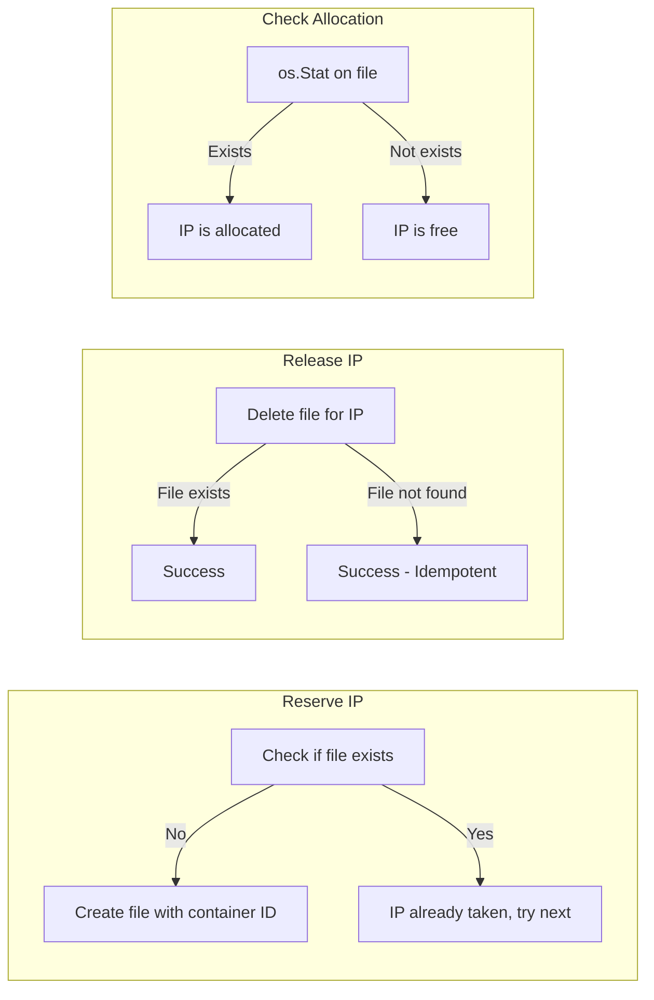

## Section: Concepts - File-Based Storage

### File Operations

```mermaid
flowchart LR
    subgraph "Reserve IP"
        R1[Check if file exists] -->|No| R2[Create file with container ID]
        R1 -->|Yes| R3[IP already taken, try next]
    end

    subgraph "Release IP"
        D1[Delete file for IP]
        D1 -->|File exists| D2[Success]
        D1 -->|File not found| D3[Success - Idempotent]
    end

    subgraph "Check Allocation"
        C1[os.Stat on file] -->|Exists| C2[IP is allocated]
        C1 -->|Not exists| C3[IP is free]
    end
```

## Section: Concepts - Allocation Strategy

### IP Allocation Algorithm

