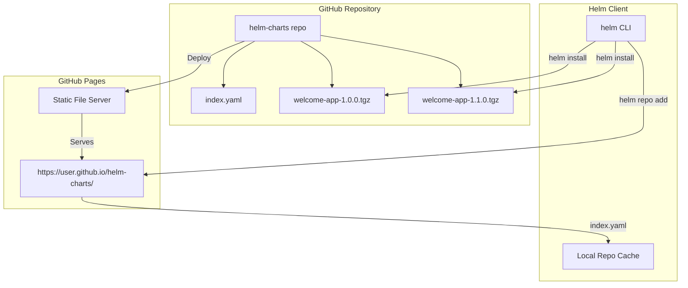
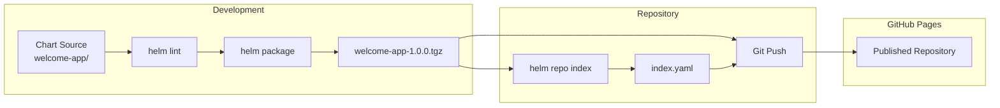
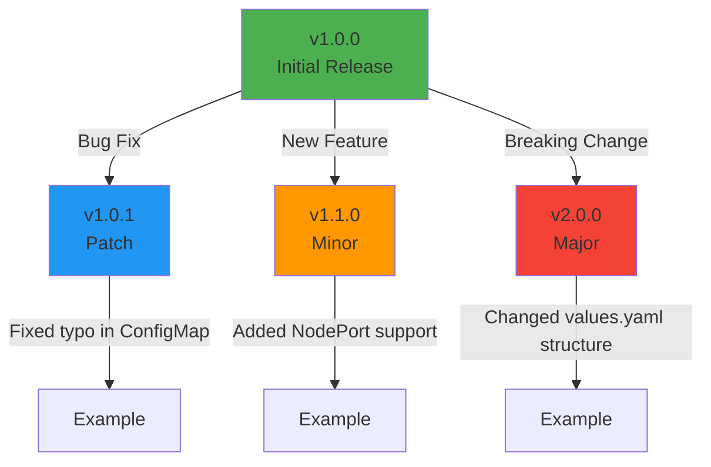
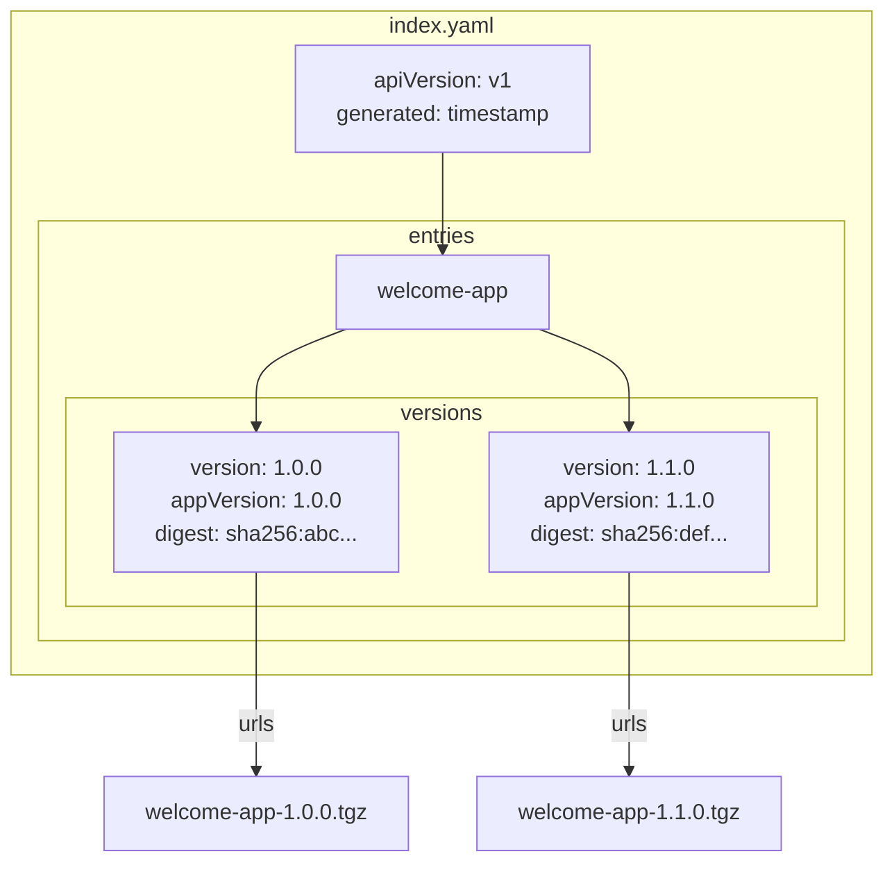
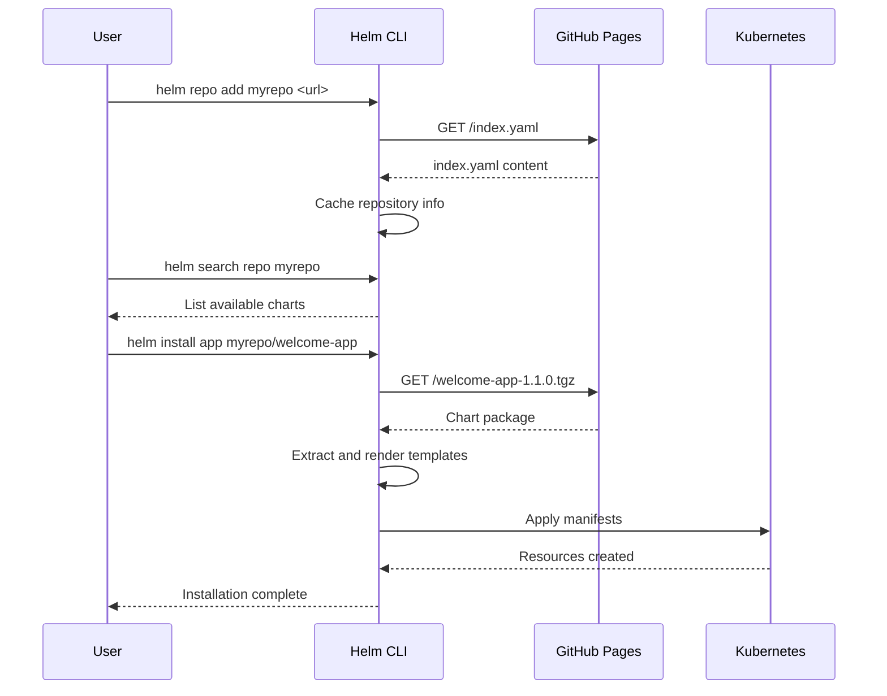
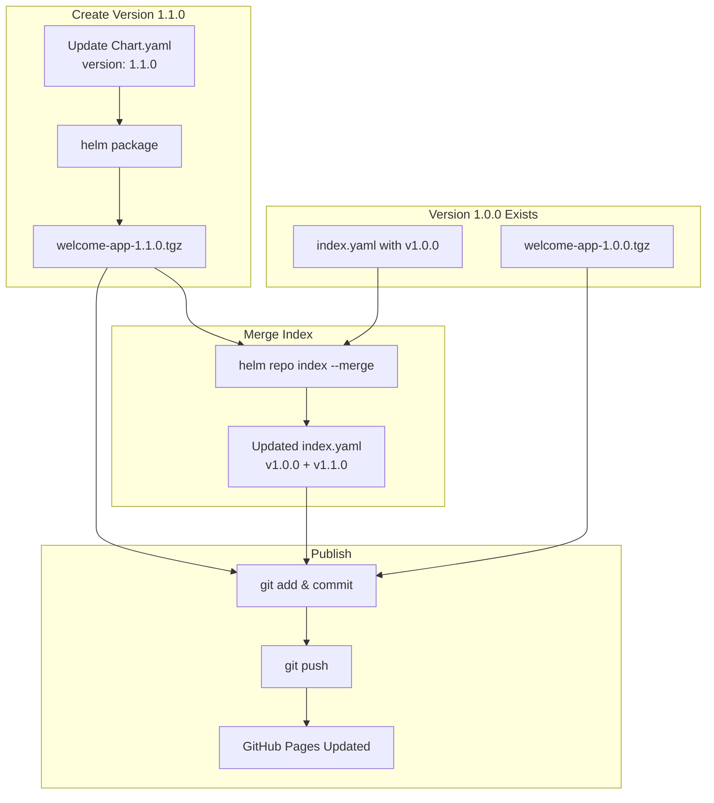
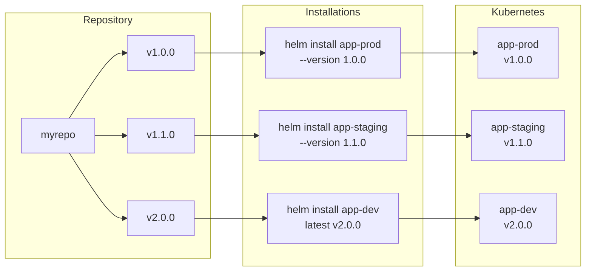
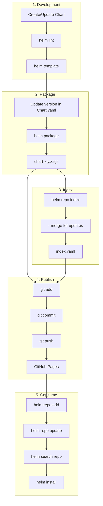

# Lab 04: Architectural Diagrams

## 1. Helm Repository Architecture



## 2. Package and Publish Workflow



## 3. Semantic Versioning



## 4. Index.yaml Structure



## 5. Client Repository Interaction



## 6. Repository Update Flow



## 7. Multi-Version Installation



## 8. GitHub Pages Setup

```mermaid
flowchart TB
    subgraph "GitHub Repository Settings"
        A[Settings]
        B[Pages]
        C[Source: Deploy from branch]
        D[Branch: main]
        E[Folder: / root]
    end

    subgraph "Repository Contents"
        F[main branch]
        G[index.yaml]
        H[*.tgz files]
    end

    subgraph "Published Site"
        I[https://user.github.io/helm-charts/]
        J[/index.yaml]
        K[/welcome-app-1.0.0.tgz]
    end

    A --> B --> C --> D --> E
    F --> G
    F --> H
    E -->|Deploy| I
    G --> J
    H --> K
```

## 9. Complete Workflow Overview


