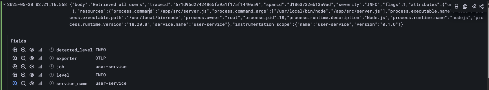
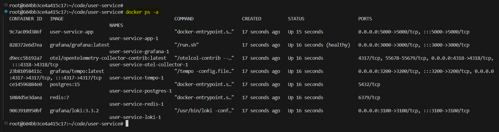
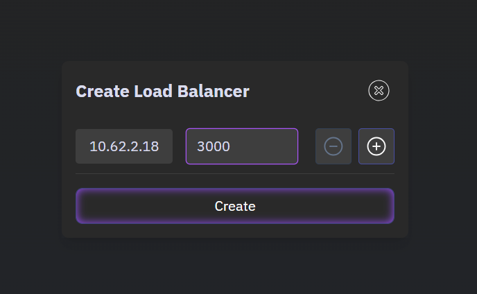
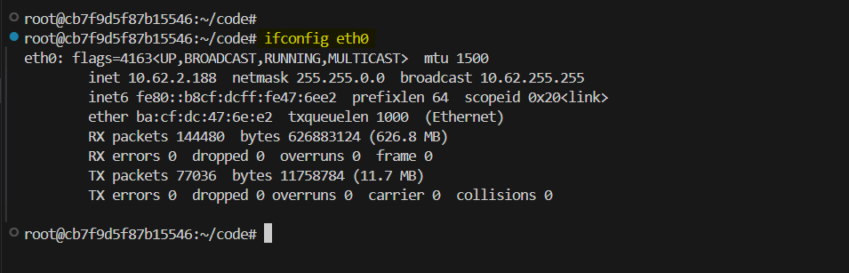
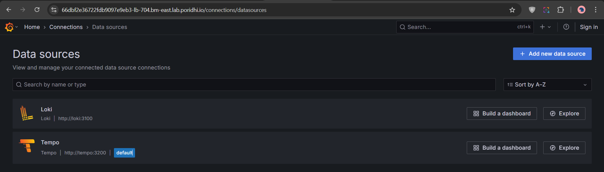
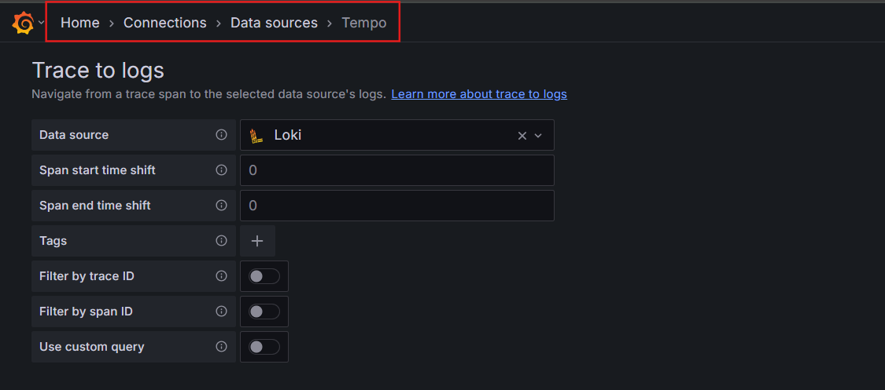
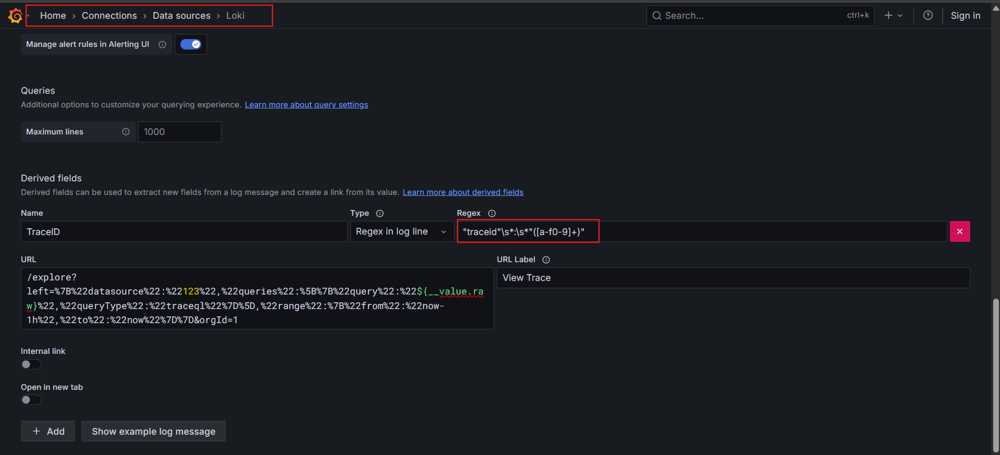
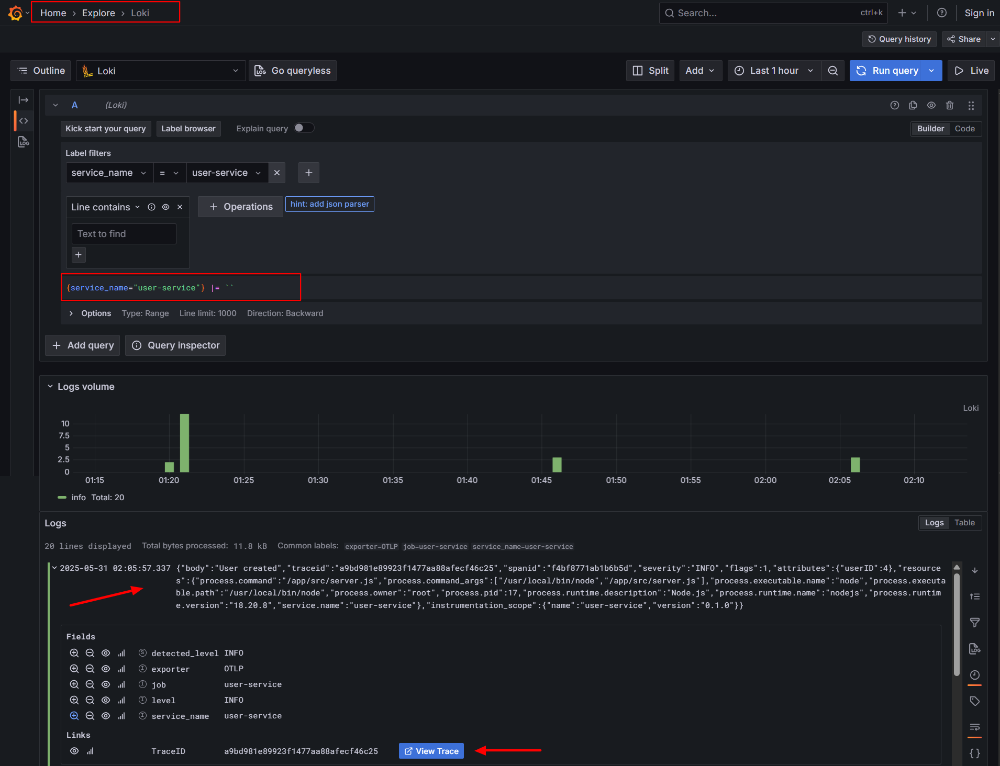
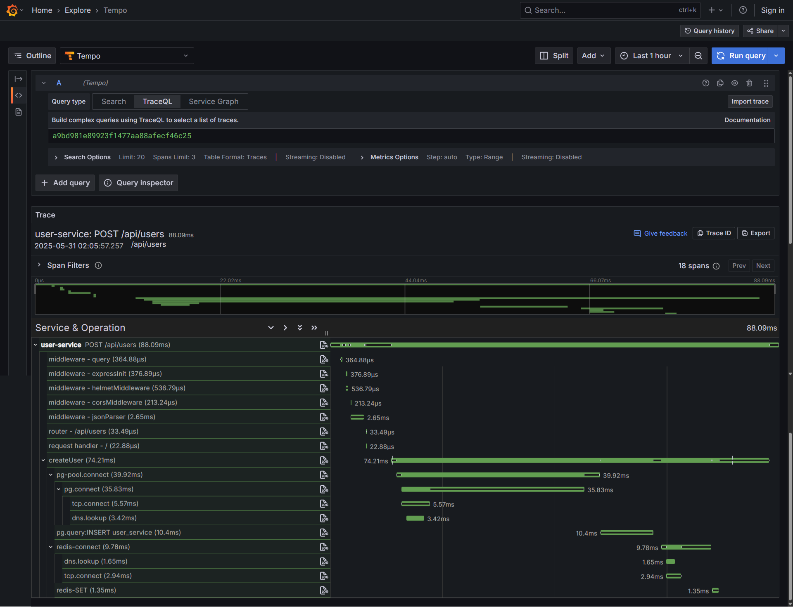

# OpenTelemetry Logging and Tracing

OpenTelemetry Logging is a component of the OpenTelemetry project, an open-source observability framework designed to standardize the collection, processing, and export of telemetry data (logs, metrics, and traces) from applications and systems. In this lab, we will learn how to use OpenTelemetry Logging to capture, structure, and export log data from an application.


### **What is OpenTelemetry Logging?**

OpenTelemetry Logging refers to the logging component of the OpenTelemetry framework, which provides a standardized approach to capturing, structuring, and exporting log data from applications and infrastructure. Logs are textual or structured records that describe events, errors, or state changes in a system, such as user actions, system errors, or debugging information.

The logging component of OpenTelemetry is designed to:

- **Standardize log collection**: Provide a consistent format and API for generating logs across different programming languages and platforms.
- **Integrate with traces and metrics**: Correlate logs with traces and metrics to provide a unified view of system behavior.
- **Enable distributed systems observability**: Work seamlessly in distributed environments, such as microservices, by associating logs with trace context.

### Limitations of non-OpenTelemetry Solutions

Traditional logging solutions often lack strong integration with other observability signals like traces and metrics. In most cases, logs are only loosely connected to tracing and monitoring tools through links that rely on partial or inconsistent correlation data. This correlation can be unreliable, as attributes are typically added to logs, traces, and metrics using different tools or collection agents.


### **Use of OpenTelemetry Collector** 

The OpenTelemetry Collector is a powerful tool that can be used to route logs to Loki and traces to Tempo. By using the OpenTelemetry Collector, we can ensure that the logs and traces are correlated correctly.


### **What is Log Correlation?**

Log correlation refers to the process of associating log entries with other telemetry data, such as traces or metrics, to provide a unified view of system behavior. In distributed systems, where a single request may span multiple services, correlating logs with traces is particularly valuable for debugging and monitoring. 

By linking logs to specific traces, we can:

- **Trace a Request’s Journey**: Understand the sequence of operations (spans) a request triggers across services and see the corresponding logs for each step.
- **Diagnose Issues**: Identify where errors occur by examining logs associated with a specific trace or span.

In our setup, log correlation specifically means **linking logs (stored in Grafana Loki) with traces (stored in Grafana Tempo)** using a shared identifier, typically the `traceId`. This allows us to navigate from a log entry to its corresponding trace in Grafana’s UI, or vice versa, to analyze issues in our Node.js application.

## Lab setup

We will continue expanding our previous application "user-service" by integrating Opentelemetry logging and. To implement logging in our Node.js application with the goal of achieving log correlation, we can use OpenTelemetry Logging in combination with Grafana Loki as the backend for storing and querying logs.

## How the Connections Work

- **Node.js App to Postgres**: The Node.js application uses a Postgres client library to connect to the Postgres database.
- **Node.js App to Redis**: The Node.js application uses a Redis client library to connect to the Redis server.
- **Node.js App to OpenTelemetry Collector**: The node.js app exports the telemetry data to OpenTelemetry Collector for storage.
- **OpenTelemetry Collector to Tempo**: The OpenTelemetry Collector exports the traces to Tempo for storage.
- **OpenTelemetry Collector to Loki**: The OpenTelemetry Collector exports the logs to Loki for storage.
- **Grafana to Tempo**: Grafana queries Tempo to retrieve and visualize the stored traces.
- **Grafana to Loki**: Grafana queries Loki to retrieve and visualize the stored logs.

## CodeBase Overview

Clone this repository to your local machine (Poridhi's VsCode Server)

```bash
git clone https://github.com/poridhioss/user-service.git
```

You will see the following folder structure:

```
user-service/
├── src/
│   ├── config/
│   │   └── db.js
│   │   └── redis.js
│   │   └── logger.js
│   ├── controllers/
│   │   └── userController.js
│   ├── services/
│   │   └── userService.js
│   ├── repositories/
│   │   └── userRepository.js
│   ├── routes/
│   │   └── userRoutes.js
│   ├── middlewares/
│   │   └── errorHandler.js
│   │   └── validateRequest.js
│   ├── utils/
│   │   └── cache.js
│   ├── app.js
│   ├── tracing.js
│   └── server.js
├── docker-compose.yml
├── tempo/
│   ├── tempo.yaml
|
|-- loki
|   |--loki-config.yaml
|
|-- otel-collector
|   |--otel-collector-config.yaml
|
├── grafana/
│   ├── provisioning/
│       └── datasources/
│           └── datasource.yml
├── Dockerfile
├── package.json
├── .env.example
└── .gitignore
```


#### **1. Node.js Application Instrumentation**

Our application is instrumented with OpenTelemetry for both tracing and logging, which is the foundation for correlation.

**Tracing**:

- In `userController.js`, we use OpenTelemetry’s tracing API to create spans for operations like `createUser`, `getUser`, etc. Each span is part of a trace, identified by a unique `traceId` and `spanId`.
- Example:
    ```javascript
    const tracer = trace.getTracer('user-service');
    return tracer.startActiveSpan('createUser', async (span) => {
        // Span attributes and events
        span.setAttribute(SemanticAttributes.HTTP_METHOD, 'POST');
        span.setAttribute('app.user.id', user.id);
        // ...
    });
    ```
- The `startActiveSpan` method sets the span as the active context, associating it with the current request. This context includes the `traceId` and `spanId`.

**Logging**:

- In `logger.js`, we use OpenTelemetry’s logging API (`@opentelemetry/api-logs`) to emit logs.
    ```javascript
    logger.info('User created', {
        userId: user.id,
    });
    ```
- When a log is emitted within an active span (as in `userController.js`), OpenTelemetry automatically attaches the current span’s `traceId` and `spanId` to the log record as attributes. This is handled by the OpenTelemetry Logging SDK, which integrates with the tracing context.

**How Correlation Happens**:

- The `traceId` is a unique identifier for a trace, which spans multiple services or operations. The `spanId` identifies a specific operation within that trace.
- When a log is emitted during an active span, OpenTelemetry’s context propagation mechanism ensures the log record includes the `traceId` and `spanId` of the active span. This creates a direct link between the log and the trace.

#### **2. OpenTelemetry Collector**

The OpenTelemetry Collector acts as a central hub for receiving, processing, and exporting telemetry data.

**Configuration** (`otel-collector/otel-collector-config.yaml`):

- **Receives Logs and Traces**: The Collector receives traces via OTLP gRPC (`port 4317`) and logs via OTLP HTTP (`port 4318`) from our Node.js application.
- **Preserves Context**: The Collector forwards logs to Loki and traces to Tempo without modifying the `traceId` or `spanId` attributes, ensuring the correlation identifiers remain intact.
- **Batching**: The `batch` processor groups logs and traces to optimize export, reducing overhead while maintaining the integrity of the `traceId` and `spanId`.

By routing both logs and traces through the Collector, we ensure consistent handling of telemetry data, preserving the `traceId` for correlation.

#### **3. Grafana Loki for Log Storage**

Loki stores and indexes logs, making them queryable in Grafana.

**Configuration** (`loki/loki-config.yaml`):

```yaml
limits_config:
allow_structured_metadata: true
```
- The `allow_structured_metadata: true` setting enables Loki to store OpenTelemetry log attributes (e.g., `traceId`, `spanId`, `userId`) as structured metadata, which is critical for correlation.

**How Logs Are Stored**:

- Logs are sent to Loki via the OpenTelemetry Collector’s `loki` exporter in a format compatible with Loki’s LogQL.
- Each log entry is associated with labels (e.g., `service_name="user-service"`) and includes structured metadata with attributes like `traceId` and `spanId`.

- Example log:

    

**Role in Correlation**:

Loki stores the `traceId` as metadata, which can be queried in Grafana. The `traceId` links each log to a specific trace in Tempo, enabling navigation between logs and traces.

#### **4. Grafana Tempo for Trace Storage**

Tempo stores traces, which consist of spans linked by a `traceId`.

**Configuration** (`tempo/tempo.yaml`):

```yaml
distributor:
receivers:
    otlp:
    protocols:
        grpc:
        endpoint: 0.0.0.0:4317
```
Tempo receives traces via OTLP gRPC from the OpenTelemetry Collector.


**How Traces Are Stored**:

Each trace is a collection of spans, identified by a unique `traceId`. Spans include attributes (e.g., `app.user.id`, `http.method`) and events, as defined in `userController.js`.
Tempo stores the `traceId`, which matches the `traceId` in logs stored in Loki. Grafana can query traces by `traceId` to display the full request flow and associated spans.

#### **5. Grafana for Visualization and Correlation**

Grafana ties everything together by providing a UI to query logs (from Loki) and traces (from Tempo) and navigate between them.

**Loki Data Source**:
- Configured to connect to `http://loki:3100`.
- Queries logs using LogQL, e.g., `{service_name="user-service"}`.
- Displays log attributes like `traceId`, `spanId`, and `userId`.

**Tempo Data Source**:
  - Configured to connect to `http://tempo:3200`.
  - Queries traces by `service.name="user-service"` or specific `traceId`.


## DockerBase Deployment

**1. Build and start all services**

```bash
docker-compose up --build -d
```

**2. Check if all services are running**

```bash
docker ps -a
```



Wait for all services to be in the "running" state.

> Troubleshooting: If you encounter any issues, checks the logs for any errors. Some of the services might take a few seconds to properly initialize. Might be a race condition. So restarting the services might help.

## Testing the System

To test the system, we will use the following endpoints:

### 1. Create a User (`POST /api/users`)

```bash
curl -X POST http://localhost:5000/api/users \
  -H "Content-Type: application/json" \
  -d '{"name": "Bob", "email": "bob@example.com"}' | jq
```


### 2. Get a Specific User (`GET /api/users/:id`)

Replace `<id>` with the actual user ID returned from the POST request (e.g., `1`):

```bash
curl http://localhost:5000/api/users/1 | jq
```


### 3. Update a User (`PUT /api/users/:id`)

```bash
curl -X PUT http://localhost:5000/api/users/7 \
  -H "Content-Type: application/json" \
  -d '{"name": "Bob Updated", "email": "bob.updated@example.com"}' | jq
```


### 4. Delete a User (`DELETE /api/users/:id`)

```bash
curl -X DELETE http://localhost:5000/api/users/3 | jq
```

### 5. Get All Users (`GET /api/users`)

```bash
curl http://localhost:5000/api/users | jq
```


Run the above commands one by one to see the traces in the Grafana Tempo dashboard.

## Grafana Tempo Dashboard

To access Grafana, Create a Load Balancer in the **Poridh's Load Balancer section** by providing the following details:

- IP: `eth0`
- Port: `3000`



To get the eth0 IP, run the following command:

```bash
ifconfig eth0
```



This will provide you with a load balancer URL. Open that URL in your browser to access Grafana.

> If you are running this on you local machine, you can simple visit http://localhost:3000 to access Grafana.

## Grafana Dashboard Setup:

First, make sure the datasources are properly added. To check if the datasources are properly added, go to  **Home > Connections > Data Sources** section in Grafana.



**Tempo Data Source**:

In the **Tempo Data Source** section, configure the **Trace to logs** to connect to the correct data source (Loki).



> You can further apply the Filters.

**Loki Data Source**:

We will configure our Loki data source to be able to view traces in the Loki data source. So, we have to add a Derived Field to the Loki data source. Go to the **Loki Data Source** section in Grafana and click on the **Fields** tab. Add a new derived field with the following configuration:

- `Name`: TraceID
- `Regex`: "traceid"\s*:\s*"([a-f0-9]+)"
- `URL label`: View Trace
- `URL`:

```bash
/explore?left=%7B%22datasource%22:%22123%22,%22queries%22:%5B%7B%22query%22:%22${__value.raw}%22,%22queryType%22:%22traceql%22%7D%5D,%22range%22:%7B%22from%22:%22now-1h%22,%22to%22:%22now%22%7D%7D&orgId=1
```



Here, `123` is the data source ID.

Save and test the data source.

### **Verifying Correlation**

To confirm that correlation is working:

**Check Logs in Grafana**:

- In Grafana’s **Explore** view, select the Loki data source.
- Query: `{service_name="user-service"}`.
- Look for a log like `User created` with a `traceId` attribute (e.g., `traceId=abcdef1234567890abcdef1234567890`).

  

- Click on the View Trace button to see the trace in Tempo.

  
    

## Conclusion

In this lab, we learned how to use OpenTelemetry Logging to capture, structure, and export log data from an application. We also learned how to use Grafana Tempo to store and query traces, and how to use Grafana Loki to store and query logs. We also learned how to use Grafana to visualize and correlate logs and traces.


