# Replication & Understanding CAP Theorem

Till now, we have achieved perfect load distribution with virtual nodes—each Redis node handling exactly 33.3% of the load. But there's a critical problem: **if any node fails, all keys on that node are lost forever**. That's unacceptable for production systems.

In this lab, We'll implement **master-replica replication** and experience the **CAP theorem trade-offs** firsthand. You'll see how async replication gives you speed and availability, but at the cost of potential data loss. Then you'll experiment with **sync** replication and measure the performance impact.


## The Problem We’re Solving

In the previous lab, virtual nodes ensured that data was **evenly distributed** across the cluster. However, distribution alone does not protect you from failures.Now consider what happens when a cache node goes down.

### What Goes Wrong

When a node fails:

* **About one-third of the data becomes unreachable**
* There is **no way to recover** the lost keys
* Client requests for those keys return errors
* Parts of your application stop working

Even though the data was well balanced, it was **not protected**.


### What We Need

To make the system resilient, we need:

* **Replication** so data survives node failures
* A clear understanding of **consistency vs. availability** trade-offs
* A foundation for **automatic failover**, which will be introduced later

### The Solution

The solution is to introduce **replica nodes** that copy data from primary nodes.
By replicating data asynchronously, the system can tolerate failures while maintaining high performance.

This transforms simple distribution into true fault tolerance.


## Understanding CAP Theorem

The CAP Theorem is a core concept in distributed database systems. CAP stands for **Consistency, Availability, and Partition Tolerance**. Proposed by **Eric Brewer in 2000**, it states that a distributed system can guarantee **only two of these three properties at the same time**.


### What Does CAP Mean?

- **Consistency (C)**: All nodes in a distributed system see the same data at the same time. If one node updates data, every other node immediately reflects that update, ensuring correctness across the system.

  
- **Availability (A)**: Availability, on the other hand, guarantees that every request receives a response. It doesn’t matter if the server is up-to-date or not and contains the latest data.

  
- **Partition Tolerance (P)**: The system keeps functioning even if network failures split nodes into separate groups that cannot communicate. Each partition can still operate independently without crashing the system.

  

### CAP Theorem Statement

In the presence of a network partition, a distributed system must choose between **Consistency** and **Availability**.
Partition tolerance is unavoidable in distributed systems, so the real trade-off is **C vs A**.

* Choose **Consistency** → Requests may be delayed or rejected.
* Choose **Availability** → Responses are returned, possibly with stale data.


### CAP Trade-Off Categories

| Type   | Prioritizes                        | During Partition | Data Returned  | Example Use Case      |
| ------ | ---------------------------------- | ---------------- | -------------- | --------------------- |
| **CA** | Consistency + Availability         | Fails            | Always correct | Single-node databases |
| **AP** | Availability + Partition Tolerance | Continues        | May be stale   | Social media, DNS     |
| **CP** | Consistency + Partition Tolerance  | Blocks requests  | Always correct | Banking systems       |


## Visualizing the CAP Theorem

### Async Replication — **AP (Availability + Partition Tolerance)**

In this setup, the primary system responds immediately to requests, while replication to other systems occurs later. This approach helps keep the system available even when failures happen. However, there is a risk of data loss if the primary crashes before the replication process is completed.

**Sequence Diagram (Async Replication)**

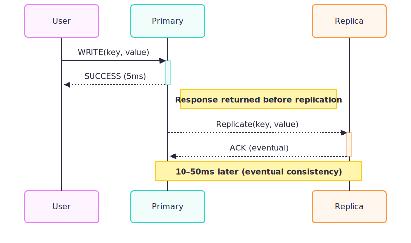

**Failure Scenario (Data Loss)**

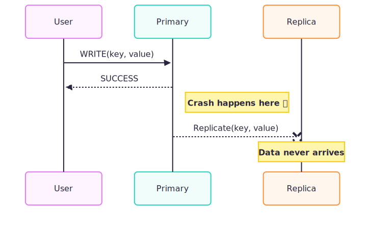

### Sync Replication — **CP (Consistency + Partition Tolerance)**

In synchronous replication, which follows the CP (Consistency and Partition Tolerance) model, the primary system waits for confirmation from replicas before completing a write. A user only receives a success response once the data has been safely stored on the replicas. This approach provides strong consistency but is slower than asynchronous methods and may reject write operations during failures to preserve data correctness.

**Sequence Diagram (Sync Replication)**

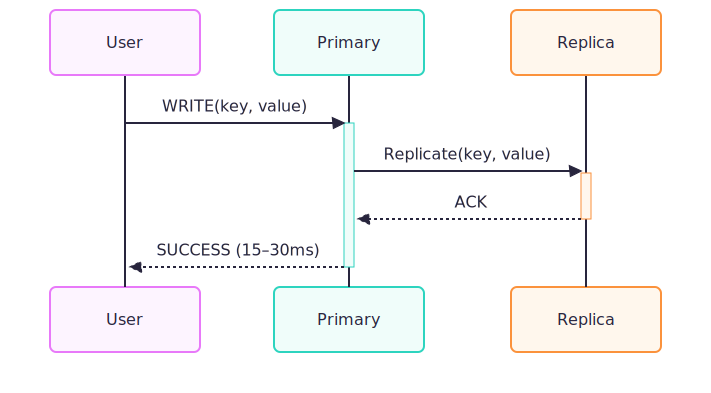

**Failure Scenario (Write Rejected)**

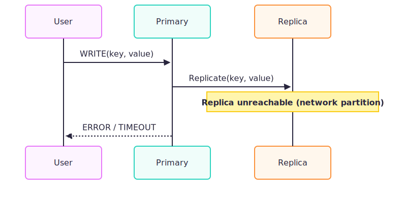

## Architecture Overview

This architecture represents a **horizontally scalable, distributed caching system with asynchronous replication**. 

- Client requests first pass through an **Nginx load balancer**, which distributes traffic across multiple **stateless API servers**. 

- The API servers forward requests to a **coordinator/router layer**, which uses hashing to determine the responsible cache shard.

- Each shard is managed by a **primary cache node** that handles all read and write operations for its assigned keys. Every primary asynchronously replicates data to a corresponding **replica node**, which serves as a read-only backup for fault tolerance.


## Environment Setup

First clone this repository and checkout Lab 5:

```bash
git clone https://github.com/poridhioss/Distributed_RedisCache.git
cd Distributed_RedisCache
git checkout lab/05
```

## Codebase Walkthrough

### 1. Docker Compose Setup for Master Replica Configuration

**Primary Nodes:**

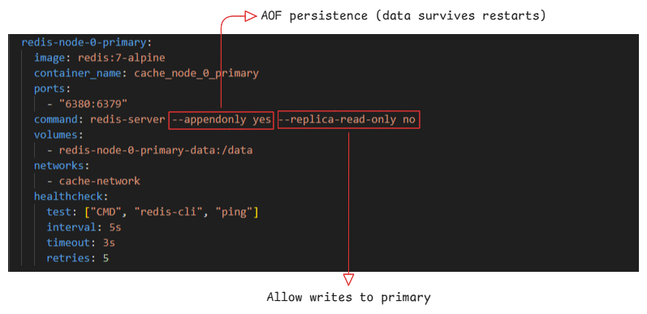

**Replica Nodes:**
- `--replicaof <primary_host> <primary_port>`: Configure as replica
- `--replica-read-only yes`: Safety - prevent accidental writes
- `--appendonly yes`: Persist replicated data
- Ports: 6390, 6391, 6392 (external access)
- `depends_on` with health checks: Wait for primaries to be ready

### 2. Enhanced Consistent Hash Ring with Replication

This file `coordinator/ConsistentHashRingWithReplication.js`: replaces single Redis clients per node with primary–replica pairs, adds replication-aware writes, sync/async control, and replication observability, while keeping the hashing and virtual-node logic unchanged.

**1. Constructor Update:**

```js
constructor(primaryNodes, replicaNodes, virtualNodeCount = 150, replicationMode = 'async')
```

* Split node config into **primaryNodes** and **replicaNodes**
* Added **replicationMode** (`async` | `sync`)
* Node count now refers to **primary–replica pairs**

**2. Node Storage Structure**

Node now represents a **replication group**. Replaced single Redis client with:

  * `primary.client`
  * `replica.client`

```js
this.nodes.set(nodeName, {
  id,
  name,
  primary: { client, host, port },
  replica: { client, host, port }
});
```

**3. Connect / Disconnect Logic**

Connection lifecycle now includes **both primary and replica**

```js
node.primary.client.connect()
node.replica.client.connect()
```

**4. SET Operation (Write Path)**

* Writes go **only to primary**
* Optional **synchronous replication** using Redis `WAIT`
* Async replication is implicit (Redis handles it)

```js
await node.primary.client.set(key, value)

if (effectiveMode === 'sync') {
  await node.primary.client.wait(1, 1000)
}
```

**5. GET Operation**

* Explicitly reads from **primary only**
* Prepares code for future replica failover

```js
await node.primary.client.get(key)
```

**6. DELETE Operation**

* Deletes routed through **primary**
* Replication handles replica deletion


```js
await node.primary.client.del(key)
```

### 3. Explore the other files

The remaining files are mostly the same as in the previous version, with only minor changes. Review them to identify those differences.

## Start the System

Build and start all services:

```bash
docker compose up -d --build
```

Check the status:

```bash
docker compose ps
```

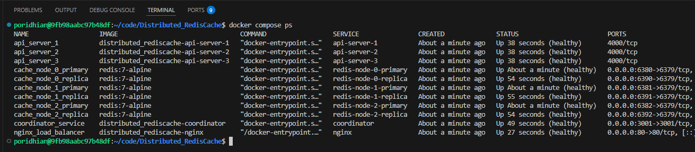

**Watch the logs:**

```bash
docker compose logs -f coordinator
```

You should see:

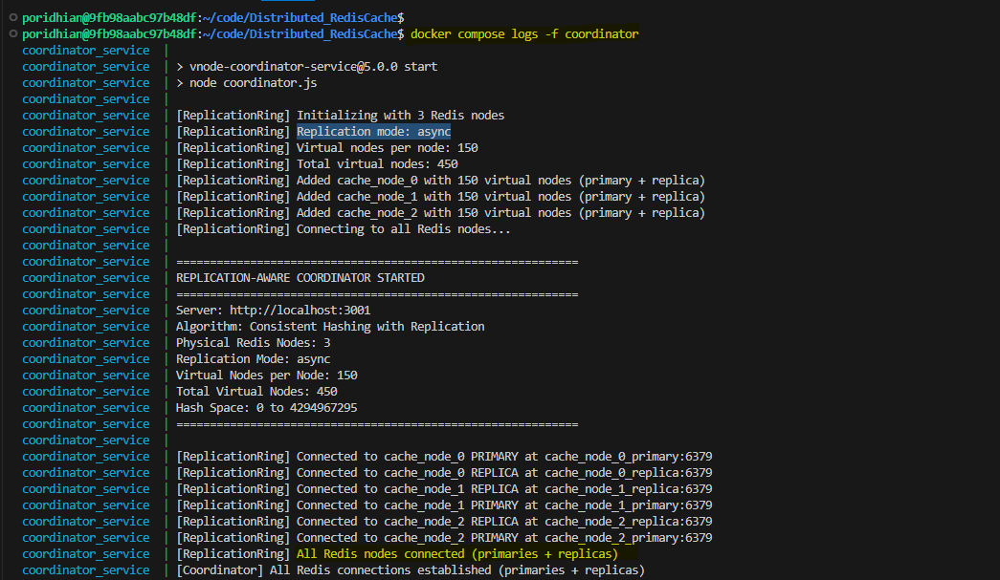

**Verify replication is working:**

Check primary-replica connections

```bash
docker exec cache_node_0_primary redis-cli INFO replication | grep connected_slaves
```

Run this command inside the Redis replica container to check whether it’s currently connected to its master:

```bash
docker exec cache_node_0_replica redis-cli INFO replication | grep master_link_status
```

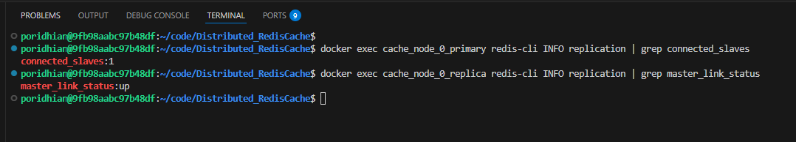

## Testing the System

### Test 1: Verify Replication Setup

Check that replication is configured correctly:

```bash
curl http://localhost:3001/replication/status | jq
```

**Expected output:**

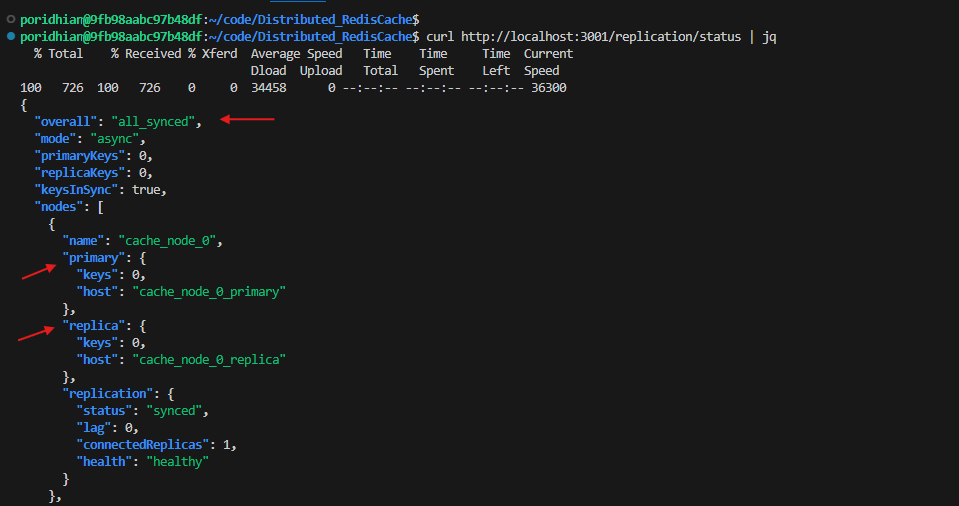

### Test 2: Write and Verify Replication

Write some data and confirm it replicates:

```bash
# Write a key
curl -X POST http://localhost/cache \
  -H "Content-Type: application/json" \
  -d '{"key":"test:replication","value":"Hello from Lab 5!"}' | jq
```

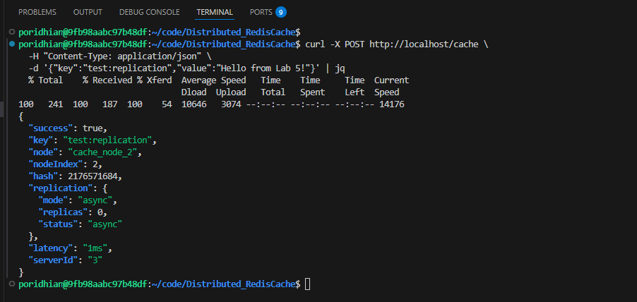

Check primary:

```bash
docker exec cache_node_2_primary redis-cli GET "test:replication"
```
> Replace the primary node name according to which actually stores the data. For our case `cache_node_2`

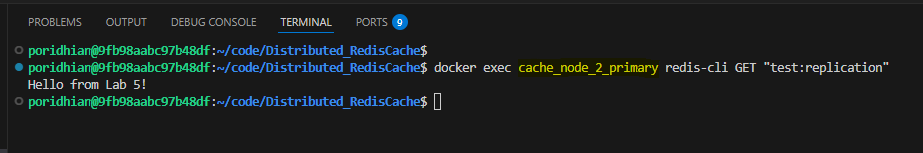

Check replica (should be there almost immediately)

```bash
docker exec cache_node_2_replica redis-cli GET "test:replication"
```

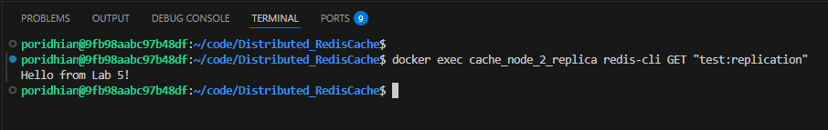

### Test 3: Load 1000 Keys and Monitor Replication

Run the `populate-cache.sh` script file to load 1000 keys:

```bash
chmod +x populate-cache.sh
./populate-cache.sh
```

**Check distribution:**

```bash
curl http://localhost:3001/distribution | jq
```

**Expected output:**

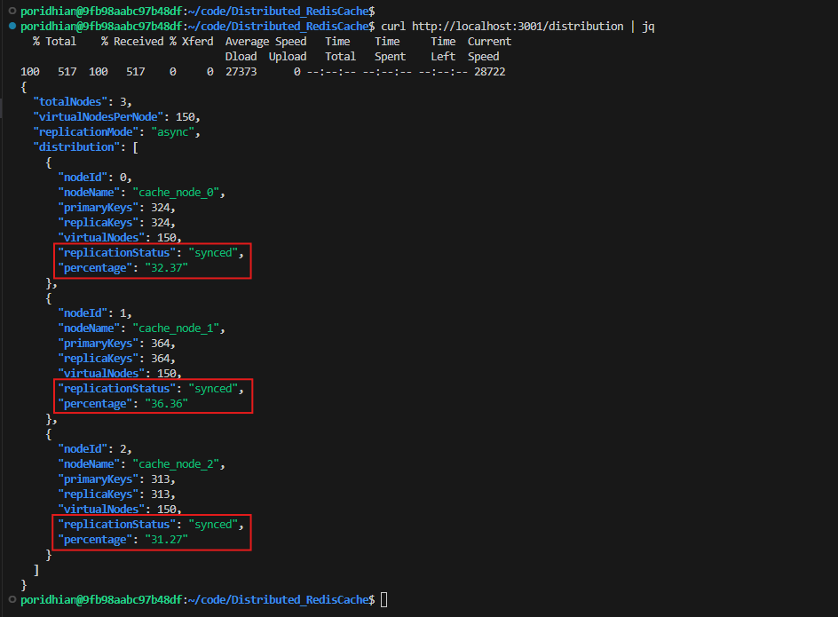

**Perfect!** Notice `primaryKeys` matches `replicaKeys` for each node.

### Test 4: Observe Replication Lag Under Load

Now run the `test-replication-lag.sh` script to generate rapid writes and measure replication lag:

Create `test-replication-lag.sh`:

```bash
chmod +x test-replication-lag.sh
./test-replication-lag.sh
```

**Expected output:**

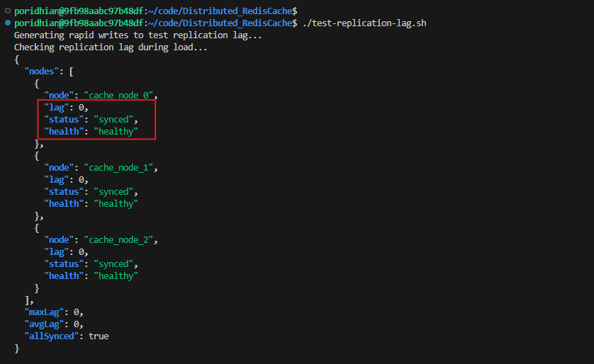

#### Why No Lag is Observed?

1. Redis is VERY Fast at Replication
Redis replication is extremely efficient, especially in a local Docker environment where:
- Network latency is near-zero (containers on same host)
- No actual network congestion
- Redis can replicate 10,000+ operations per second easily

In practice, we need extreme load or network issues to see significant lag.

### Test 5: Compare Async vs Sync Replication Performance

Next run this script to compare the performance `test-async-vs-sync.sh`:

```bash
chmod +x test-async-vs-sync.sh
./test-async-vs-sync.sh
```

**Expected output:**

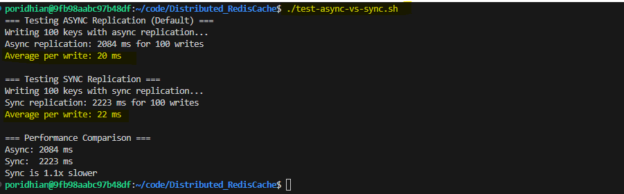

**This output demonstrates the consistency–performance trade-off in Redis replication:**

* **Async replication (AP-leaning):**

  * 2084 ms for 100 writes (~20 ms/write)
  * Writes return as soon as the **primary** acknowledges them
  * Replicas are updated **later**, so performance is higher
  * Risk: a replica may lag or miss recent writes if the primary fails

* **Sync replication (CP-leaning):**

  * 2223 ms for 100 writes (~22 ms/write)
  * Each write waits for **replica acknowledgment**
  * Slightly higher latency due to coordination
  * Benefit: stronger consistency guarantees

**What the numbers mean**

* Sync writes are only **~1.1× slower**
* The small gap suggests:
  * Low network latency
  * Few replicas
  * Light write contention

In real distributed or high-latency environments, this gap grows significantly

## Conclusion

In this lab, you successfully transformed a distributed cache system from a simple load-balanced architecture into a fault-tolerant, replicated system capable of surviving node failures. By implementing master-replica replication, you gained hands-on experience with the fundamental trade-offs described by the CAP theorem. You observed how asynchronous replication prioritizes availability and performance (AP), allowing the system to respond quickly but accepting the risk of potential data loss during failures. Conversely, synchronous replication enforces stronger consistency guarantees (CP) by waiting for replica acknowledgment, though at a measurable performance cost.
