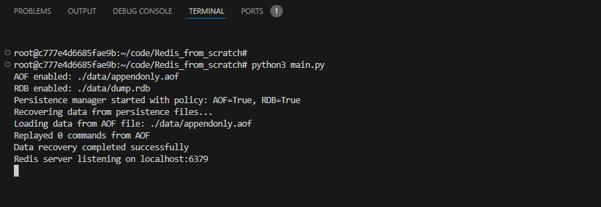
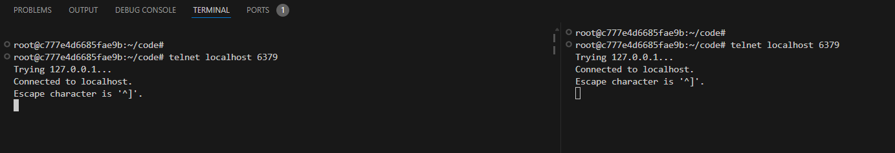
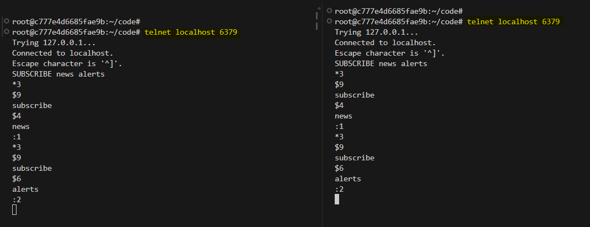
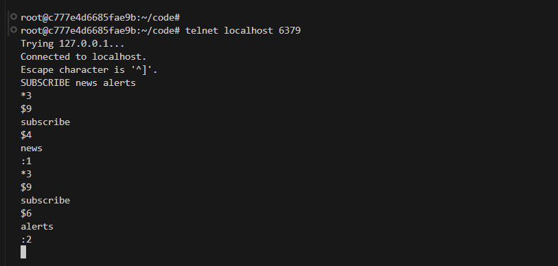
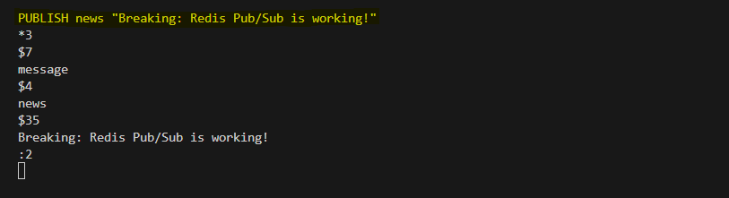
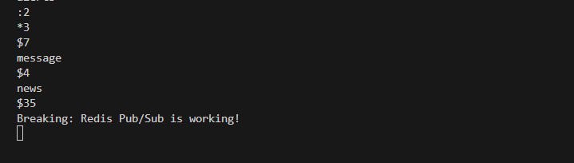
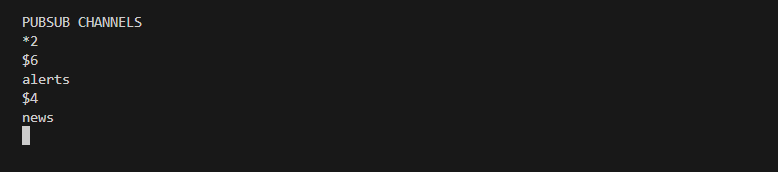
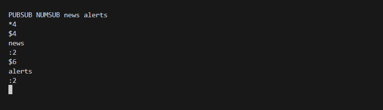

# Publish/Subscribe Messaging System

In this lab, we will extend our Redis server to implement a publish/subscribe messaging system. The system will allow clients to subscribe to channels and receive messages published to those channels. The pub/sub system is a fundamental building block for real-time applications, enabling efficient communication between clients and servers.


## System Architecture

The system is designed as a modular architecture, with each component handling specific responsibilities to ensure efficient data management and persistence. The architecture is illustrated below:


**Component Roles**

- **RedisServer**: Network layer, client management, event loop coordination

- **CommandHandler**: Command parsing, execution routing, response formatting

- **DataStore**: In-memory key-value storage with TTL management

- **PersistenceManager**: Central coordinator for all persistence operations

- **AOFWriter**: Logs write commands to disk with configurable sync policies

- **RDBHandler**: Creates snapshots (`SAVE`, `BGSAVE`), forks processes, and serializes data.

- **Recovery Manager**: Replays `AOF` commands during startup to restore data otherwise `.rdb` files on startup, deserializes data, and verifies integrity.

- **Storage Layer**: Stores `aof` and `.rdb` files on disk for backup and recovery, ensuring data can be restored after restarts.

## What is a Pub/Sub Messaging System?

The Publish/Subscribe messaging system, commonly abbreviated as Pub/Sub, is a messaging paradigm designed to enable asynchronous communication in distributed environments. In this model, message senders, known as publishers, do not directly target specific recipients. Instead, they categorize messages into channels or topics and publish them to these channels. On the receiving end, subscribers express interest in one or more channels and receive messages published to those channels without knowledge of the publishers. This decoupling of publishers and subscribers promotes scalability, as the system can handle dynamic changes in the number of participants without requiring reconfiguration.

### Fire & Forget

A defining characteristic of Redis Pub/Sub is its fire-and-forget delivery model. Publishers send messages without awaiting acknowledgments or confirmations from subscribers. Once a message is published, the system makes no further attempts to ensure delivery if a subscriber fails to receive it due to network issues, errors, or disconnections. 


This approach prioritizes speed and low overhead, making it suitable for applications where occasional message loss is tolerable, such as live updates or logging. There are no built-in retry mechanisms, aligning with the at-most-once semantics and emphasizing simplicity over reliability.

### Fan-out Only

Redis Pub/Sub is designed exclusively for fan-out messaging, where a single published message is broadcast to all active subscribers of the channel. This one-to-many distribution occurs efficiently, with a time complexity of `O(N+M)`, where N represents the number of channel subscribers and M the number of pattern subscribers. Pattern subscriptions (via `PSUBSCRIBE`) extend this by allowing messages to fan out to clients matching channel patterns, such as `news.*`. 


Notably, if a client subscribes to both a specific channel and a matching pattern, it may receive the same message multiple times, which applications must handle idempotently. This fan-out-only focus distinguishes Redis Pub/Sub from more complex systems that might support filtering or routing at the subscriber level.

### No Relation to the Keyspace

One of the key design principles in Redis Pub/Sub is its complete independence from the Redis keyspace. Channels and messages do not interact with stored keys, databases, or any data persistence mechanisms. For instance, publishing a message on one database (e.g., database 10) will be received by subscribers on another (e.g., database 1), as Pub/Sub operates across the entire instance without regard to database boundaries. 


This isolation ensures that Pub/Sub does not interfere with key-value operations, allowing developers to use it alongside other Redis features seamlessly. To achieve scoping or isolation (e.g., between environments like "test" and "production"), channel names can be prefixed manually, but no native keyspace linkage exists.


## Codebase Walkthrough

To set up the Codebase, clone the repository and run the Python script:


```bash
git clone https://github.com/poridhioss/Redis_from_scratch.git
cd Redis_from_scratch
python3 main.py
```



### Core Files

The implementation is organized into a modular codebase, with each component handling a specific responsibility:

```bash
├── main.py
├── redis_server
│   ├── __init__.py
│   ├── command_handler.py
│   ├── commands
│   │   ├── __init__.py
│   │   ├── base.py
│   │   ├── basic.py
│   │   ├── expiration.py
│   │   ├── hash.py
│   │   ├── info.py
│   │   ├── list.py
│   │   ├── persistence.py
│   │   ├── pubsub.py
│   │   └── set.py
│   ├── persistence
│   │   ├── __init__.py
│   │   ├── aof.py
│   │   ├── config.py
│   │   ├── manager.py
│   │   ├── rdb.py
│   │   └── recovery.py
│   ├── pubsub.py
│   ├── response.py
│   ├── server.py
│   └── storage.py
```

### 1. PubSubManager

`pubsub.py` file is essentially an in-memory implementation of a **publish–subscribe system**, similar in spirit to Redis Pub/Sub. Acts as a **message broker** for channels. Clients can **subscribe** to channels. When a message is **published** to a channel, all subscribed clients **immediately receive** it. It’s **fire-and-forget** → messages are **not queued** or persisted. If a client isn’t connected at the time of publish, they miss the message.


#### **Key Data Structures**

1. **Channels → Clients mapping**

    Maps each **channel name** to a set of **subscribed clients**.

   ```python
   self.channels: Dict[str, Set[Any]] = defaultdict(set)
   ```

2. **Clients → Channels mapping**

    Tracks which channels each client is subscribed to.

   ```python
   self.client_subscriptions: Dict[Any, Set[str]] = defaultdict(set)
   ```

3. **Statistics counters**

   ```python
   self.total_messages_published = 0
   self.total_subscriptions = 0
   ```

   Tracks metrics for monitoring/debugging.

#### **Core Methods**

- **subscribe(client, *channels)**

   This method adds client to one or more channels. Then updates both mappings (`channels` and `client_subscriptions`). After that it increments `total_subscriptions`. Returns `(channel, subscription_count)` for each channel.

   ```python
   pubsub.subscribe(client1, "news", "sports")
   # => [("news", 1), ("sports", 2)]
   ```

- **unsubscribe(client, *channels)**

   If no channels provided → unsubscribes from **all**. Removes client from `channels` and `client_subscriptions`. Cleans up empty channels. Decrements `total_subscriptions`.
   Returns `(channel, remaining_subscription_count)` for each.


- **publish(channel, message)**

   This method looks up all subscribers for the given channel. For each subscriber:

   * Builds a message response using Redis-style encoding:

      ```python
      ['message', channel, message]
      ```
   * Sends it via `client.send(response)`. If send fails → assumes client disconnected → calls `_cleanup_client`. Finally returns number of clients the message was successfully delivered to.

### 2. **PubSubCommands** 

Implements Redis-like **Pub/Sub command handling**. Serves as a bridge between **client-issued commands** (strings like `"SUBSCRIBE news"`) and the **PubSubManager** (which maintains the actual channel–subscriber mappings). Returns responses in **Redis Serialization Protocol (RESP)** format (`bulk_string`, `array`, `integer`, etc.).

#### **Methods**

- **set_current_client(client)**

   This method stores which client is currently running commands. This is needed so `SUBSCRIBE` knows **who** to subscribe.

- **subscribe(channels)**

   Implements **`SUBSCRIBE channel [channel ...]`**.

   **Workflow:**

   1. Validates input (`channels` must not be empty).
   2. Ensures `self.current_client` and `self.pubsub_manager` are available.
   3. Calls:

      ```python
      results = self.pubsub_manager.subscribe(self.current_client, *channels)
      ```

      Which returns tuples like:

      ```python
      [("news", 1), ("sports", 2)]
      ```
   4. For each subscription, constructs a Redis-style response:

      ```python
      ["subscribe", channel, subscription_count]
      ```

      encoded using RESP helpers (`bulk_string`, `integer`, `array`).

   Returns a concatenated RESP response with **subscription confirmations**.


- **unsubscribe(channels)**

   Implements **`UNSUBSCRIBE [channel [channel ...]]`**.

   **Workflow:**

   1. If `channels` empty → unsubscribe from **all**.
   2. Calls:

      ```python
      results = self.pubsub_manager.unsubscribe(self.current_client, *channels)
      ```

      Returns tuples like `[("news", 0), ("sports", 1)]`.
   3. If no results (client wasn’t subscribed to anything) → returns:

      ```python
      ["unsubscribe", None, 0]
      ```
   4. Otherwise builds responses:

      ```python
      ["unsubscribe", channel, remaining_subscription_count]
      ```

- **publish(channel, message_parts)**

   Implements **`PUBLISH channel message`**.

   **Workflow:**

   1. Validates input.
   2. Joins `message_parts` into a single string.
   3. Calls:

      ```python
      subscriber_count = self.pubsub_manager.publish(channel, message)
      ```
   4. Returns RESP integer = number of clients that got the message.


## Testing the System

To validate the functionality our Redis-like system, we can perform a series of tests.

**Start the Redis server:**

Launch the Redis server by running the main application script. This initializes the server, including the persistence manager and AOF components.

```bash
python3 main.py
```

### Commands

Run this command in two seperate terminal to simulate two clients:

```bash
telnet localhost 6379
```



#### 1. SUBSCRIBE Command

Subscribe client1 and client2 to the channels.

```python
# Subscriber
SUBSCRIBE news alerts
```



The general format of the output is:

```
*3                 # array of 3 elements
$9                 # bulk string of length 9
subscribe          # message type ("subscribe")
$<len> <channel>   # channel name
:<count>           # total number of channels this client is subscribed to
```

**Client 1 Response**

From the client1 response we can see that, 



* `*3` → 3 elements in this reply
* `subscribe` → indicates it’s a subscription confirmation
* `news` → the channel subscribed to
* `:1` → this client is now subscribed to **1 channel**

Then again:

* Another confirmation for the `alerts` channel
* `:2` means this client is now subscribed to **2 channels total**

**Client 2 Response**

It’s identical to Client 1 response, confirming both clients are subscribed to news and alerts.

#### 2. PUBLISH Command

```
# Publisher  
PUBLISH news "Breaking: Redis Pub/Sub is working!"
PUBLISH alerts "System maintenance in 10 minutes"
```

Client1 Response:



This command sends a message (`"Breaking: Redis Pub/Sub is working!"`) to the channel `news`. Redis internally counts how many subscribers are currently listening to `news`.


* `*3` → This means it’s a **multi-bulk reply** with 3 parts.

* `$7`
  `message` → First field: the type of Pub/Sub event. This tells the client that a **message** was delivered.

* `$4`
  `news` → Second field: the **channel name** where the message was published.

* `$35`
  `Breaking: Redis Pub/Sub is working!` → Third field: the **actual message body** (your payload).

**The trailing `:2`**

Redis always replies to `PUBLISH` with the **number of subscribers** that received the message. Here: `:2` → **Two subscribers** were subscribed to `news` at the time.

* Client 1 subscribed to `news`
* Client 2 subscribed to `news`

So the message reached **both**.

Client2 Response:



1. `*3`
   → This means the response is an **array with 3 elements**.

2. `$7` → `message`
   → The **first element** of the array is the string `"message"`.
   This tells you what type of Pub/Sub message it is.

3. `$4` → `news`
   → The **second element** is the channel name (`news`) on which the message was published.

4. `$35` → `Breaking: Redis Pub/Sub is working!`
   → The **third element** is the actual **message payload** that was published.

**Interpretation for client2**:

> Client2 (subscriber) received a normal `"message"` event on the channel `"news"`, with the content:
> `"Breaking: Redis Pub/Sub is working!"`.

So client1 (publisher) saw `:2` meaning 2 subscribers got the message. Client2 (subscriber) saw this message because it was subscribed to `news`.


### Channel Management

**List active channels**

```bash
PUBSUB CHANNELS
```


* `*2` → This means the Redis server is returning an **array with 2 elements** (two active channels).
* `$6` → The first element is a **bulk string with 6 characters**.
* `alerts` → That’s the first channel name.
* `$4` → The second element is a **bulk string with 4 characters**.
* `news` → That’s the second channel name.

**Get subscriber count for specific channels**

```bash
PUBSUB NUMSUB news alerts
```



1. `*4` → Array of 4 elements is coming.
   Redis RESP (Redis Serialization Protocol) always starts with array length.

2. `$4` → Next element is a bulk string of length 4.
   That string is:

   ```
   news
   ```

3. `:2` → This is an integer: **2**
   → Meaning: channel `news` currently has **2 subscribers**.

4. `$6` → Next bulk string is of length 6:

   ```
   alerts
   ```

5. `:2` → Another integer: **2**
   → Meaning: channel `alerts` also has **2 subscribers**.

## Conclusion

Redis Pub/Sub provides a simple yet powerful messaging system that prioritizes speed and simplicity through its fire-and-forget delivery model. The system exclusively supports fan-out messaging with efficient O(N+M) distribution, while maintaining complete isolation from the Redis keyspace. It offers basic channel management capabilities but intentionally omits features like message persistence or queuing.


