# PostgreSQL on AWS

In this lab, we will provision the infrastructure for the PostgreSQL database and pgAdmin server. `pgAdmin` is a web-based tool that allows you to manage your PostgreSQL databases. This lab will guide you through the process of provisioning the infrastructure, configuring the PostgreSQL database, and connecting pgAdmin to PostgreSQL.

## Environment Setup for Infrastructure Provisioning

For the AWS infrastructure, we will require two EC2 instances. One will be the pgAdmin server and the other will be the PostgreSQL database server. The PostgreSQL database will be installed on the db server and pgAdmin container will be running on the pgAdmin server. PostgreSQL EC2 instance will be in private subnet and pgAdmin EC2 instance will be in public subnet. We will also need a VPC, subnets, security groups, NAT Gateway, Internet Gateway, Route Table, and EC2 instances. Here is the diagram of the infrastructure.


### 1. Configure AWS CLI

The AWS CLI is a command-line tool that allows you to interact with AWS services programmatically. It simplifies provisioning resources, such as EC2 instances and load balancers, which are required to host our database cluster and application server. Lets configure the AWS CLI.

```bash
aws configure
```

- `AWS Access Key ID:` Your access key to authenticate AWS API requests.
- `AWS Secret Access Key:` A secret key associated with your access key.
- `Default region:` The AWS region in which you want to provision your resources (ap-southeast-1).
- `Default output format:` You can choose the output format (JSON, text, table).

> Get your access key and secret access key from `Poridhi's lab` account by generating AWS credentials.


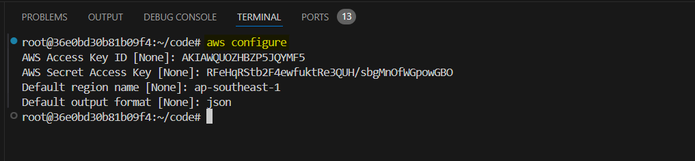


### 2. Provisioning Compute Resources

In this step, we will provision the necessary AWS resources that will host our DB and pgAdmin server.

**1. Create a Directory for Your Infrastructure**

Before starting, it’s best to create a dedicated directory for the infrastructure files:

```bash
mkdir db-infra
cd db-infra
```

**2. Install Python venv**

Set up a Python virtual environment (venv) to manage dependencies for Pulumi or other Python-based tools:

```bash
sudo apt update
sudo apt install python3.8-venv -y
```

This will set up a Python virtual environment which will be useful later when working with Pulumi.

**3. Initialize a New Pulumi Project**

Pulumi is an Infrastructure-as-Code (IaC) tool used to manage cloud infrastructure. In this tutorial, you'll use Pulumi python to provision the AWS resources required for Database Cluster.

First login to Pulumi by running the command in the terminal. You will require a **token** to login. You can get the token from the Pulumi website.

```bash
pulumi login
```

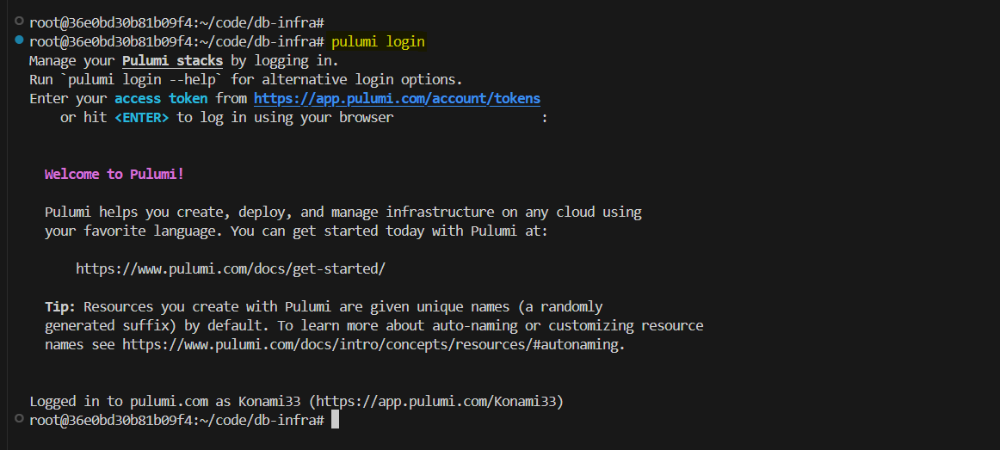

After login, run the following command to initialize a new Pulumi project:

```bash
pulumi new aws-python
```

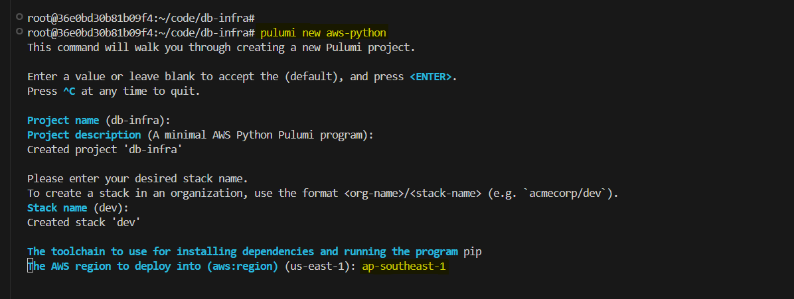

You will prompted with serveral questions. Go with the default options. Only change the aws region to `ap-southeast-1`.


**4. Update the `__main.py__` file:**

Open the `__main__.py` file in the project directory and define the AWS infrastructure required for the Database and pgAdmin server. This Pulumi code provisions the foundational infrastructure required to set up a Database and pgAdmin server on AWS. It handles the creation of a Virtual Private Cloud (VPC), subnets, security group, NAT Gateway, Internet Gateway, Route Table, and EC2 instances. It will also execute the cloud-init script to install the **PostgreSQL** database in the db server and **Docker** in the pgAdmin server.

```python
import pulumi
import pulumi_aws as aws
import os


# variables
instance_type = 't2.micro'
ami = 'ami-01811d4912b4ccb26'

# Create a VPC
vpc = aws.ec2.Vpc(
    'postgres-db-vpc',
    cidr_block='10.0.0.0/16',
    enable_dns_support=True,
    enable_dns_hostnames=True,
    tags={'Name': 'postgres-db-vpc'}
)

# Create public and private subnets
public_subnet = aws.ec2.Subnet(
    'postgres-db-public-subnet',
    vpc_id=vpc.id,
    cidr_block='10.0.1.0/24',
    map_public_ip_on_launch=True,
    availability_zone='ap-southeast-1a',  
    tags={'Name': 'postgres-db-public-subnet'}
)

private_subnet = aws.ec2.Subnet(
    'postgres-db-private-subnet',
    vpc_id=vpc.id,
    cidr_block='10.0.2.0/24',
    map_public_ip_on_launch=False,
    availability_zone='ap-southeast-1a',  
    tags={'Name': 'postgres-db-private-subnet'}
)

# Create an Internet Gateway
internet_gateway = aws.ec2.InternetGateway(
    'postgres-db-internet-gateway',
    vpc_id=vpc.id,
    tags={'Name': 'postgres-db-internet-gateway'}
)

# Create NAT Gateway for private subnet
elastic_ip = aws.ec2.Eip('nat-eip')

nat_gateway = aws.ec2.NatGateway(
    'postgres-db-nat-gateway',
    allocation_id=elastic_ip.id,
    subnet_id=public_subnet.id,
    tags={'Name': 'postgres-db-nat-gateway'}
)

# Create public Route Table
public_route_table = aws.ec2.RouteTable(
    'postgres-db-public-route-table',
    vpc_id=vpc.id,
    routes=[
        aws.ec2.RouteTableRouteArgs(
            cidr_block='0.0.0.0/0',
            gateway_id=internet_gateway.id,
        )
    ],
    tags={'Name': 'nodejs-public-route-table'}
)

# Create private Route Table
private_route_table = aws.ec2.RouteTable(
    'postgres-db-private-route-table',
    vpc_id=vpc.id,
    routes=[
        aws.ec2.RouteTableRouteArgs(
            cidr_block='0.0.0.0/0',
            nat_gateway_id=nat_gateway.id,
        )
    ],
    tags={'Name': 'postgres-db-private-route-table'}
)

# Associate route tables with subnets
public_route_table_association = aws.ec2.RouteTableAssociation(
    'postgres-db-public-route-table-association',
    subnet_id=public_subnet.id,
    route_table_id=public_route_table.id
)

private_route_table_association = aws.ec2.RouteTableAssociation(
    'postgres-db-private-route-table-association',
    subnet_id=private_subnet.id,
    route_table_id=private_route_table.id
)

# Create security group for Node.js application
pgadmin_security_group = aws.ec2.SecurityGroup(
    'pgadmin-security-group',
    vpc_id=vpc.id,
    description="Security group for pgadmin application",
    ingress=[
        # SSH access
        aws.ec2.SecurityGroupIngressArgs(
            protocol='tcp',
            from_port=22,
            to_port=22,
            cidr_blocks=['0.0.0.0/0'],  # Consider restricting to your IP
        ),
        # pgadmin application port
        aws.ec2.SecurityGroupIngressArgs(
            protocol='tcp',
            from_port=80,
            to_port=80,
            cidr_blocks=['0.0.0.0/0'],
        ),
    ],
    egress=[
        aws.ec2.SecurityGroupEgressArgs(
            protocol='-1',
            from_port=0,
            to_port=0,
            cidr_blocks=['0.0.0.0/0'],
        )
    ],
    tags={'Name': 'pgadmin-security-group'}
)

# Create security group for PostgreSQL database
postgres_db_security_group = aws.ec2.SecurityGroup(
    'postgres-db-security-group',
    vpc_id=vpc.id,
    description="Security group for PostgreSQL database",
    ingress=[
        # SSH access from pgadmin subnet
        aws.ec2.SecurityGroupIngressArgs(
            protocol='tcp',
            from_port=22,
            to_port=22,
            cidr_blocks=[public_subnet.cidr_block],
        ),
        # PostgreSQL access from pgadmin subnet
        aws.ec2.SecurityGroupIngressArgs(
            protocol='tcp',
            from_port=5432,
            to_port=5432,
            cidr_blocks=[public_subnet.cidr_block],
        ),
    ],
    egress=[
        aws.ec2.SecurityGroupEgressArgs(
            protocol='-1',
            from_port=0,
            to_port=0,
            cidr_blocks=['0.0.0.0/0'],
        )
    ],
    tags={'Name': 'postgres-db-security-group'}
)

# Create db server
db = aws.ec2.Instance(
    'db-server',
    instance_type=instance_type,
    ami=ami,
    subnet_id=private_subnet.id,
    key_name="db-cluster",
    vpc_security_group_ids=[postgres_db_security_group.id],
    user_data_replace_on_change=True,
    user_data="""#!/bin/bash
    sudo apt update
    sudo apt install -y postgresql postgresql-contrib
    sudo systemctl start postgresql
    sudo systemctl enable postgresql
    """,
    tags={'Name': 'postgres-db-server'},
    opts=pulumi.ResourceOptions(
        depends_on=[
            nat_gateway,
            private_route_table_association,
            private_subnet
        ]
    )
)


# Create pgadmin server
pgadmin = aws.ec2.Instance(
    'pgadmin-server',
    instance_type=instance_type,
    ami=ami,
    subnet_id=public_subnet.id,
    key_name="db-cluster",
    vpc_security_group_ids=[pgadmin_security_group.id],
    associate_public_ip_address=True,
    user_data_replace_on_change=True,
    user_data="""#!/bin/bash
    sudo apt update
    sudo apt install -y docker.io
    sudo systemctl enable docker
    sudo systemctl start docker
    """,
    tags={'Name': 'pgadmin-server'}
)


# Export Public and Private IPs
pulumi.export('pgadmin_public_ip', pgadmin.public_ip)
pulumi.export('pgadmin_private_ip', pgadmin.private_ip)
pulumi.export('postgres_db_private_ip', db.private_ip)

# Export the VPC ID and Subnet IDs for reference
pulumi.export('vpc_id', vpc.id)
pulumi.export('public_subnet_id', public_subnet.id)
pulumi.export('private_subnet_id', private_subnet.id)

# Create config file
def create_config_file(all_ips):
    config_content = f"""Host pgadmin-server
    HostName {all_ips[0]}
    User ubuntu
    IdentityFile ~/.ssh/db-cluster.id_rsa

Host postgres-db-server
    ProxyJump pgadmin-server
    HostName {all_ips[1]}
    User ubuntu
    IdentityFile ~/.ssh/db-cluster.id_rsa
"""
    
    config_path = os.path.expanduser("~/.ssh/config")
    with open(config_path, "w") as config_file:
        config_file.write(config_content)

# Collect the IPs for all nodes
all_ips = [pgadmin.public_ip, db.private_ip]

# Create the config file with the IPs once the instances are ready
pulumi.Output.all(*all_ips).apply(create_config_file)
```

This pulumi code will create a config file in your `~/.ssh/config` file with the IPs of the DB and Node.js servers. It will automatically add the `IPs` to the config file when the instances are ready.


**5. Create an AWS Key Pair**

Database Cluster nodes need to communicate securely. This key pair will be used to authenticate when accessing EC2 instances. Use the following AWS CLI command to create a new SSH key pair named kubernetes:

```bash
cd ~/.ssh/
aws ec2 create-key-pair --key-name db-cluster --output text --query 'KeyMaterial' > db-cluster.id_rsa
chmod 400 db-cluster.id_rsa
```

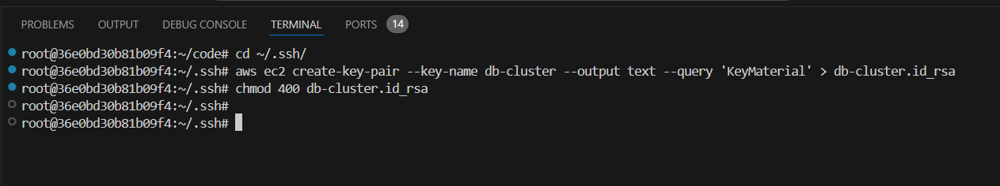

This will save the private key as `db-cluster.id_rsa` in the `~/.ssh/` directory and restrict its permissions.


**6. Provision the Infrastructure**

Run the following command to provision the infrastructure:

```bash
pulumi up --yes
```

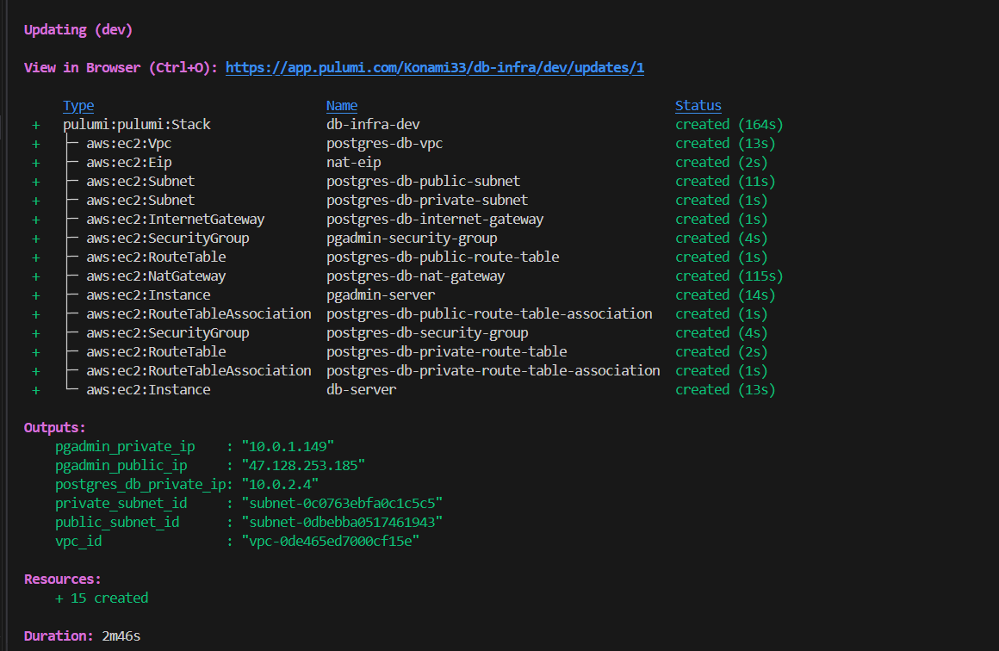

Here we can see the infrastructure is provisioned successfully. Now we can use the config file to access the pgadmin server.

#### Check the config file

After the infrastructure is provisioned, you can check the config file to see the IPs of the pgadmin server.

```bash
cat ~/.ssh/config
```

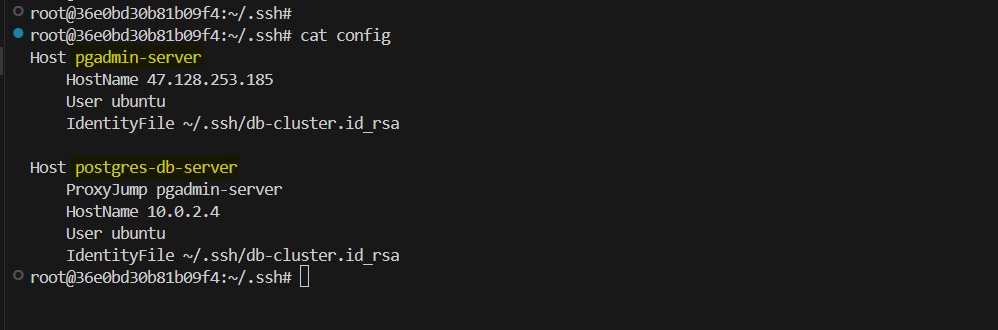


**7. SSH into the ec2 instance**

We can use the config file to access the pgadmin server.

```bash
ssh pgadmin-server
```

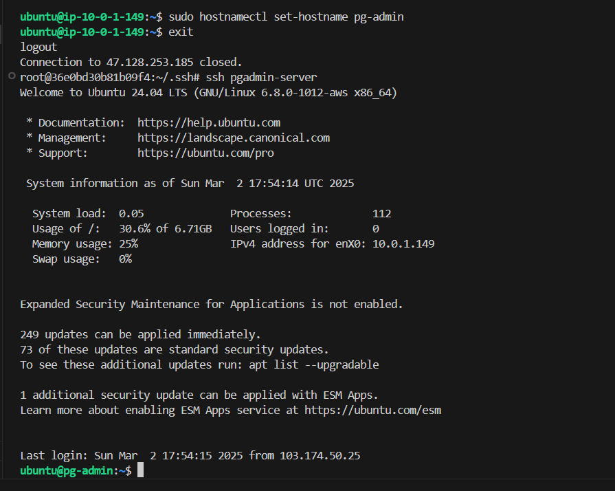

SSH into the db server.

```bash
ssh db-server
```

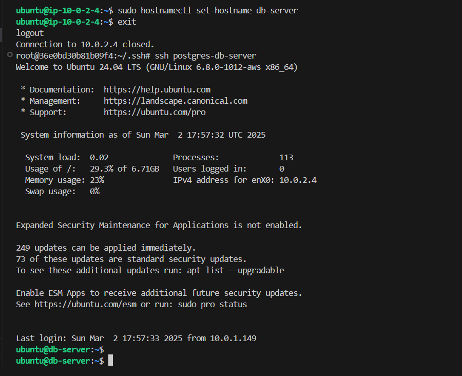


You may change the hostname to `pg-admin` and `db-server` to make it easier to identify the server. This is optional.

```bash
sudo hostnamectl set-hostname pg-admin
sudo hostnamectl set-hostname db-server
```

## Configure the PostgreSQL Database

After SSHing into the db server, first check the cloud-init logs to see if the PostgreSQL database is installed.

```bash
cat /var/log/cloud-init-output.log
```

If everything is installed correctly, we can configure the PostgreSQL database.

**1. Switch to the `postgres` user and configure PostgreSQL:**

```bash
sudo -u postgres psql
```

**2. Set a password for the `postgres` user:**

```sql
ALTER USER postgres PASSWORD 'postgres';
```

**3. Allow remote connections:**

- Edit the PostgreSQL configuration file:
    ```bash
    sudo vim /etc/postgresql/*/main/pg_hba.conf
    ```
- Add the following line to allow connections from the pgAdmin subnet:
    ```
    host    all             all             10.0.1.0/24           md5
    ```
    `10.0.1.0/24` is the CIDR block of the pgAdmin subnet. Make sure to change it to the CIDR block of your pgAdmin subnet.

- Edit the `postgresql.conf` file to listen on all interfaces:

    ```bash
    sudo vim /etc/postgresql/*/main/postgresql.conf
    ```
- Update the `listen_addresses` line:

    ```
    listen_addresses = '*'
    ```

**4. Restart PostgreSQL to apply the changes:**

```bash
sudo systemctl restart postgresql
```

You can check the status of the PostgreSQL service.

```bash
sudo systemctl status postgresql
```

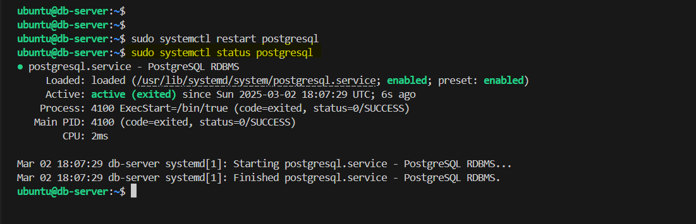


## Configure pgAdmin Server

After SSHing into the pgadmin server, first check the cloud-init logs to see if the pgAdmin server is installed.

```bash
cat /var/log/cloud-init-output.log
```

If everything is installed correctly, we can configure the pgAdmin server. In the user data, we have already installed docker. Check if Docker is running.

```bash
sudo systemctl status docker
```

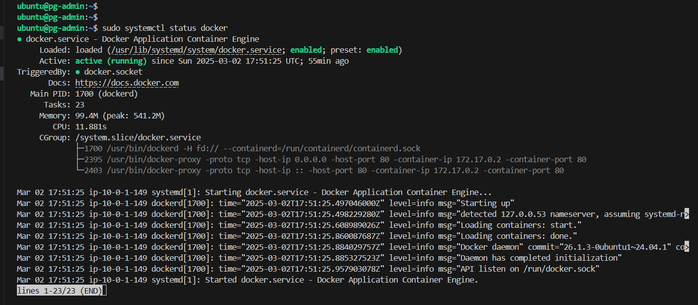

Here we can see that docker is running. Now we can run pgAdmin using Docker.

### Run pgAdmin using Docker:

We will run pgAdmin using Docker. Run this command to start pgAdmin. You can change the email and password to your desired email and password.

```bash
sudo docker run -d \
    --name pgadmin \
    -p 80:80 \
    -e PGADMIN_DEFAULT_EMAIL=admin@example.com \
    -e PGADMIN_DEFAULT_PASSWORD=admin \
    dpage/pgadmin4
```

   - Replace `admin@example.com` and `admin` with your desired email and password.
   - pgAdmin will be accessible on port 80 of the EC2 instance.

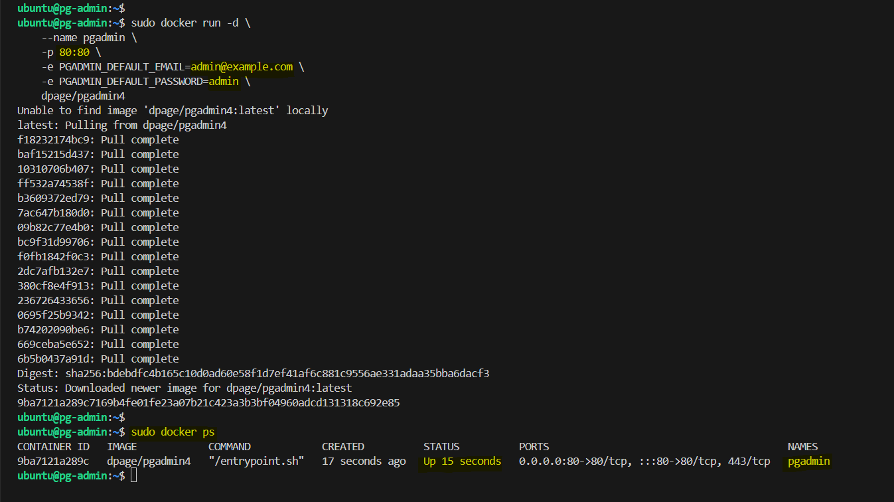

**Access pgAdmin:**

- Open your browser and navigate to:
    ```
    http://<pgadmin_public_ip>
    ```
- Log in using the email and password you set in the Docker command.


### pgAdmin UI

After logging in, you will see the pgAdmin UI.

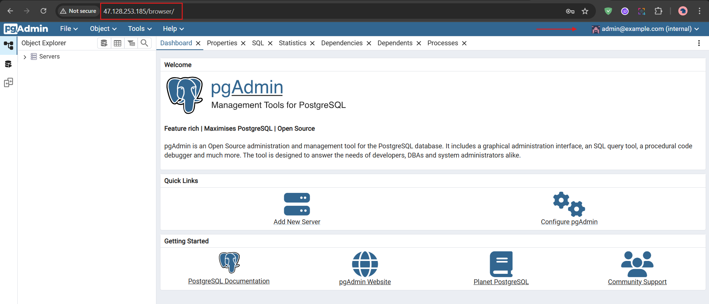


### Connect pgAdmin to PostgreSQL

1. Open pgAdmin in your browser (`http://<pgadmin_public_ip>`).

2. Add a new server:
   - Right-click on **Servers** in the left sidebar and select **Register > Server**.

   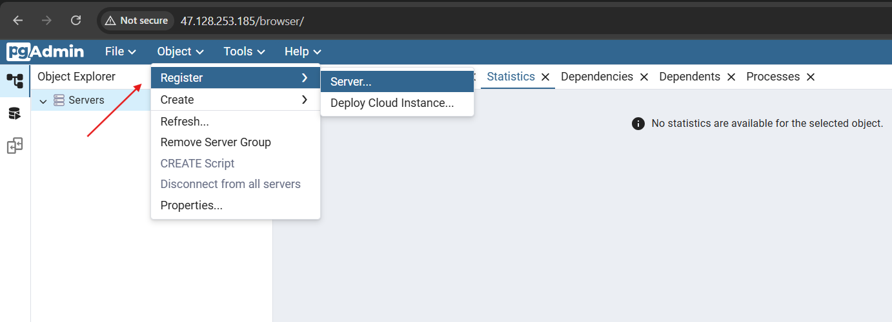

   - In the **General** tab, provide a name for the server (e.g., `PostgreSQL Server`).

   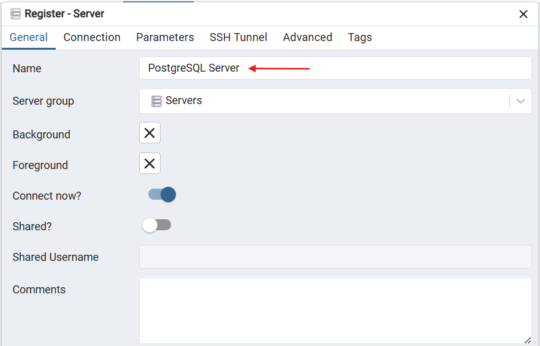

3. In the **Connection** tab:
   - **Hostname/address**: Enter the private IP of the PostgreSQL instance (`<db_private_ip>`).
   - **Port**: `5432` (default PostgreSQL port).
   - **Maintenance database**: `postgres`.
   - **Username**: `postgres`.
   - **Password**: The password you set for the `postgres` user.

   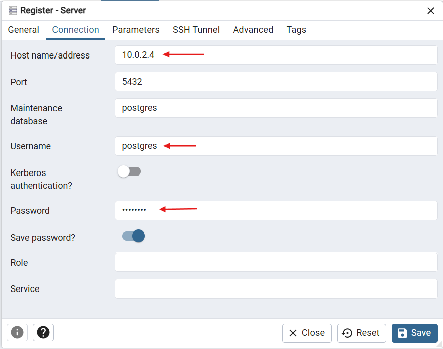

4. Click **Save**.

5. You should now see the PostgreSQL server in pgAdmin and be able to manage it.

    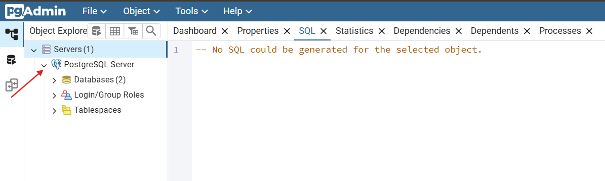


### Verify Connectivity

1. Click on the Query Tool workspace icon and connect to the server.

    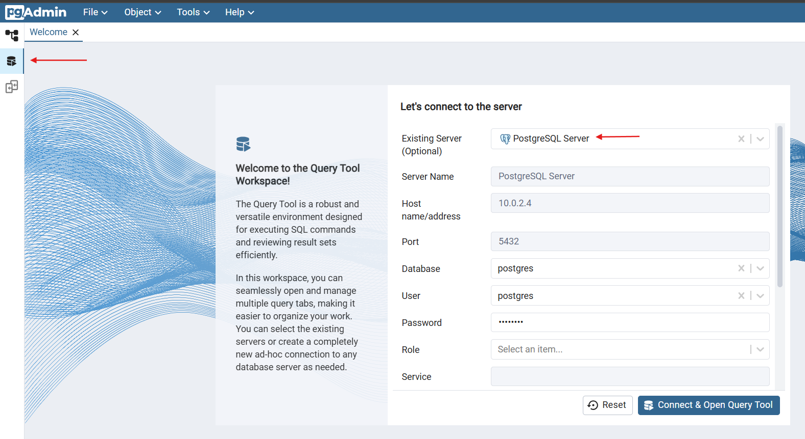

2. Run a test query (e.g., `SELECT version();`) to confirm the connection is working.


    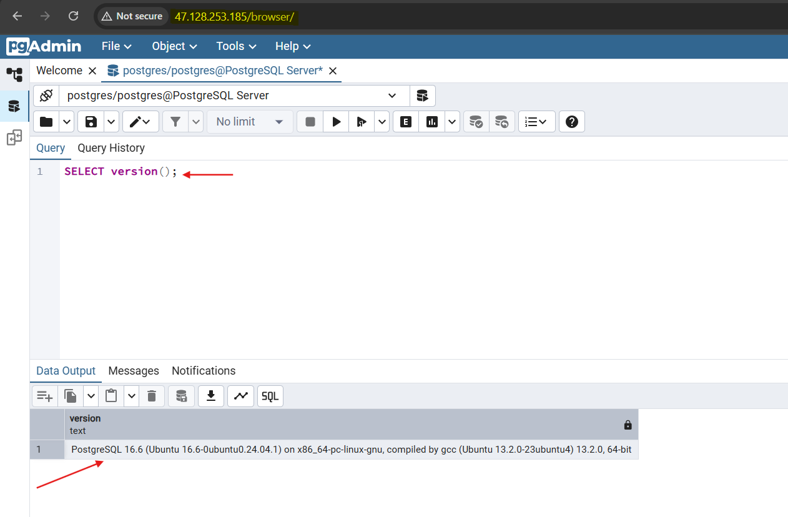


You can explore the pgAdmin UI and manage the PostgreSQL database.

## Conclusion

In this lab, we have provisioned the infrastructure for the PostgreSQL database and pgAdmin server. We have also configured the PostgreSQL database and pgAdmin server. We have also verified the connectivity between pgAdmin and PostgreSQL.


