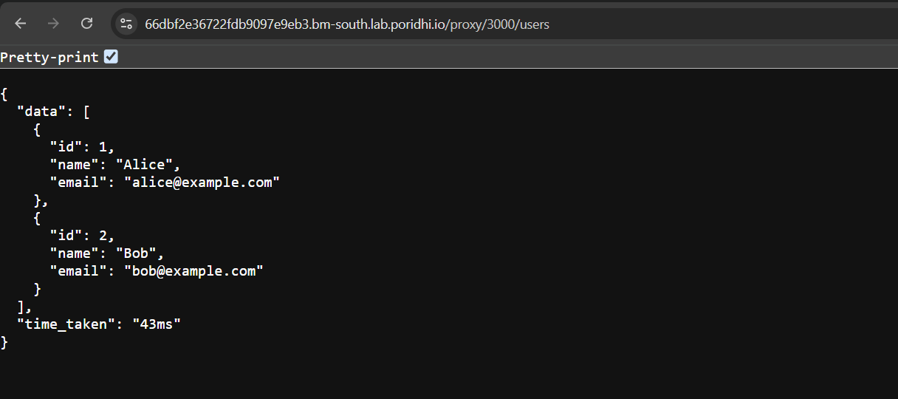

# Understanding Connection Pooling in Node.js with PostgreSQL

Database connections are an essential aspect of backend development. However, handling them efficiently is crucial to maintaining a scalable and performant application. This is where **connection pooling** comes into play. In this lab, we will dive deep into how database connections work, why connection pooling is necessary, and how to implement it in **Node.js** with **PostgreSQL**. 


## What is Connection Pooling?

Connection pooling is a technique where a predefined number of database connections (TCP connections) are maintained and shared among multiple clients. Instead of opening and closing a database connection for each request, which is expensive, a pool of connections is created and reused to handle multiple database queries efficiently.

### Why is Connection Pooling Important?

1. **Reduces Connection Overhead:** Establishing and tearing down a connection is costly, involving authentication, security handshakes, and resource allocation.
2. **Efficient Resource Utilization:** A database server has a limited number of connections it can handle at a time. Connection pooling helps optimize these connections.
3. **Faster Query Execution:** Since connections are pre-established, database queries execute faster.
4. **Prevents Connection Exhaustion:** Without pooling, excessive simultaneous connections can overwhelm the database server.

## How Database Connections Work

Before we jump into connection pooling, let's understand the **traditional approach** where a new database connection is established for every request.

### Step-by-Step Process of Database Connection:

1. **Client Sends Request:** A client (browser, API, etc.) sends a request to the backend server.
2. **TCP Connection Establishment:** The server initiates a TCP handshake with the database server.
3. **Authentication & Authorization:** The database verifies the credentials.
4. **Query Execution:** The SQL query is executed, and the result is fetched.
5. **Connection Termination:** The connection is closed after the request is completed.


This approach introduces significant overhead when handling multiple concurrent requests.

## Database installation and setup

First, we need to install PostgreSQL on our system. There are multiple ways to install PostgreSQL. Here, we will use the `apt` package manager to install PostgreSQL on a Linux system. We will also install the `postgresql-contrib` package which contains additional tools and extensions. This installation is for a Linux system.

1. Update package list:

   ```sh
   sudo apt update
   sudo apt install postgresql postgresql-contrib -y
   ```

2. Start PostgreSQL service:

   ```sh
   sudo systemctl start postgresql
   sudo systemctl enable postgresql
   ```

   Check the status of the PostgreSQL service:

   ```sh
   sudo systemctl status postgresql
   ```

3. Switch to the PostgreSQL user:

    ```sh
    sudo -u postgres psql
    ```

4. Set a password for the `postgres` user:**

  ```sql
  ALTER USER postgres PASSWORD 'postgres';
  ```

> You may create a new user. We are using the default user created by Postgres Database.

<!--  -->

## **Create a PostgreSQL Database and Table**

First, we will create a database called `testdb`.

```sql
CREATE DATABASE testdb;
\c testdb;
```

Then, we will create a table called `users` with the following columns:

```sql
CREATE TABLE users (
    id SERIAL PRIMARY KEY,
    name VARCHAR(100) NOT NULL,
    email VARCHAR(150) UNIQUE NOT NULL,
);

INSERT INTO users (name, email) VALUES
('Alice', 'alice@example.com'),
('Bob', 'bob@example.com');
```


## **Initializing a Node.js Server and Handling Database Connections**

A Node.js server is typically created using **Express.js**, which simplifies HTTP request handling. The following steps outline how to initialize a basic server:

### **Initialize a nodejs server**

```bash
npm init -y
```

### **Installing Dependencies**

Install the required dependencies using `npm`:

```sh
npm install express pg dotenv
```

- **express** → A web framework for handling HTTP requests.
- **pg** → PostgreSQL client for Node.js.
- **dotenv** → Loads environment variables from a `.env` file.

### **Configure Environment Variables**
To keep sensitive database credentials secure, we store them in a `.env` file:

#### **`.env`**

```
DB_USER=postgres
DB_HOST=localhost
DB_NAME=testdb
DB_PASSWORD=password
DB_PORT=5432
```
- **DB_USER** → PostgreSQL username.
- **DB_HOST** → Database server address.
- **DB_NAME** → Name of the database.
- **DB_PASSWORD** → Database password.
- **DB_PORT** → PostgreSQL port (default is `5432`).

> You may change the creadentials according to your requirement.

### **The Traditional Approach: One Connection per Request**

In this approach, a new connection is created and closed for each request. This is **inefficient** because:
1. Each request incurs the overhead of establishing a new connection.
2. The database might run out of available connections under high load.
3. Increased latency due to repeated connection setup and teardown.

#### **Example:**

Create a file named `index.js` which will contain the basic instructions for database connection. Here is an example code that has a endpoint: `/users` where we can get the query output from the database.

```javascript
require('dotenv').config();
const express = require('express');
const { Client } = require('pg');

const app = express();
const PORT = 3000;

app.get('/users', async (req, res) => {
    const client = new Client({
        user: process.env.DB_USER,
        host: process.env.DB_HOST,
        database: process.env.DB_NAME,
        password: process.env.DB_PASSWORD,
        port: process.env.DB_PORT,
    });

    const start = Date.now();
    
    await client.connect(); // Connect to the database
    const result = await client.query('SELECT * FROM users'); // Execute query
    await client.end(); // Close the connection
    
    const duration = Date.now() - start;

    res.json({
        data: result.rows,
        time_taken: `${duration}ms`
    });
});

app.listen(PORT, () => console.log(`Server running on port ${PORT}`));
```


### **Problems with This Approach**
- **Connection Overhead**: Establishing a new connection for each request is costly.
- **Resource Exhaustion**: If multiple clients make requests simultaneously, PostgreSQL may run out of available connections.
- **Performance Bottleneck**: Increased latency due to repeated connection creation.

To run this application, open a terminal and run:

```bash
node index.js
```

To access the UI, you can create a Load-Balancer with PORT: 3000. Then follow the URL.



Here we can see the time taken to execute the query is ~40 ms, which is too high for this simple database.

## The Connection Pooling Approach

Instead of creating a new connection for each request, we can use **a connection pool** to efficiently manage database connections. This can lead to performance improvements, especially in high-load applications. Below is a guide on how to implement connection pooling in a Node.js application using PostgreSQL.

### How Connection Pooling Works:

1. A pool of connections is created at the application startup.
2. When a request is made, an available connection is assigned from the pool.
3. Once the query is executed, the connection is returned to the pool.
4. Idle connections are maintained for future use, reducing overhead.


## Implementing Connection Pooling in Node.js

You can either update your existing `index.js` file or create a new one to simulate connection pooling. The following code demonstrates how to integrate connection pooling with PostgreSQL in a Node.js application:

```javascript
require('dotenv').config();  // Load environment variables from .env file
const express = require('express');
const { Pool } = require('pg');  // Import PostgreSQL Pool module

const app = express();
const port = 3000;

// PostgreSQL Connection Pool
const pool = new Pool({
  user: process.env.DB_USER,          // Database user
  host: process.env.DB_HOST,          // Database host
  database: process.env.DB_NAME,      // Database name
  password: process.env.DB_PASSWORD,  // Database password
  port: process.env.DB_PORT,          // Database port
  max: 10,                            // Maximum number of connections in the pool
  idleTimeoutMillis: 30000,           // Close idle connections after 30 seconds
});

app.get('/users', async (req, res) => {
  try {
    const start = Date.now();  // Capture the start time for performance measurement
    const result = await pool.query('SELECT * FROM users');  // Execute query using the connection pool
    const duration = Date.now() - start;  // Calculate the time taken for the query
    res.json({
        data: result.rows,  // Return the query results as JSON
        time_taken: `${duration}ms`  // Return the time taken for the query
    });
  } catch (err) {
    console.error('Error querying the database:', err);
    res.status(500).json({ error: 'Database query failed' });  // Handle errors
  }
});

app.listen(port, () => {
  console.log(`Server is running on http://localhost:${port}`);  // Start the server
});
```

### Run the Node.js Server

Once you've added the code to `index.js`, you can start the server using the following command:

```bash
node index.js
```

This will launch the application and it will listen for incoming requests on `http://<PORIDHI's_LOAD_BALANCER_URL>:3000`. You can access the `/users` endpoint to test the database query.


### Performance Improvement

When you use connection pooling, multiple requests can reuse the same database connections rather than creating new connections each time. This reduces the overhead and improves performance. 

For example, in the code above, after executing the query, you might notice a reduction in the time taken to retrieve data from the database. The time taken to execute the query is reduced to 3 milliseconds, indicating a significant performance improvement when connection pooling is used.

### Explanation of Pooling Parameters:

- **max**: Defines the maximum number of connections allowed in the connection pool. In the example, it's set to `10`, meaning a maximum of 10 concurrent connections can be active at the same time.
  
- **idleTimeoutMillis**: Specifies how long an idle connection can remain in the pool before being closed. In the example, it's set to `30000` milliseconds (30 seconds). If a connection is idle for longer than this period, it will be terminated and removed from the pool.

- **connectionTimeoutMillis**: This parameter defines the timeout duration for acquiring a new connection from the pool. If a connection cannot be established within this time frame, an error will be thrown. This value can be added based on your application's needs.

By implementing connection pooling, you reduce the number of database connections that need to be created and destroyed with each query, leading to better resource management and enhanced application performance.


## Performance Comparison: Traditional vs Connection Pooling in Node.js

To evaluate the performance differences between a traditional database connection approach and connection pooling, we can create two separate endpoints: one that establishes a new database connection for each request `(/old)`, and one that uses a connection pool for better resource management `(/pool)`.

## Implementation overview

We will be using the **pg** package to interact with PostgreSQL and create two endpoints in our Express server:

- `/old:` This endpoint establishes a new database connection for each request (traditional approach).
- `/pool:` This endpoint uses a connection pool, which manages multiple connections and improves performance by reusing connections.

### **Code Implementation**

```javascript
require('dotenv').config();
const express = require('express');
const { Pool, Client } = require('pg');

const app = express();
const PORT = 3000;

let oldReqCount = 0;
let oldReqSum = 0;
let poolReqCount = 0;
let poolReqSum = 0;

// Create a configuration object for PostgreSQL
const dbConfig = {
  user: process.env.DB_USER,
  host: process.env.DB_HOST,
  database: process.env.DB_NAME,
  password: process.env.DB_PASSWORD,
  port: process.env.DB_PORT,
};

// Create a pool of connections for PostgreSQL
const pool = new Pool({
  ...dbConfig,
  max: 20, // Max connections in the pool
});

// Helper function to query the database using a Client
const queryWithClient = async () => {
  const client = new Client(dbConfig);
  await client.connect();
  const results = await client.query("SELECT * FROM users");
  await client.end();
  return results.rows;
};

// Helper function to query the database using the pool
const queryWithPool = async () => {
  const results = await pool.query("SELECT * FROM users");
  return results.rows;
};

// Endpoint using a new client connection for each request
app.get("/old", async (req, res) => {
  const start = Date.now();
  oldReqCount++;

  try {
    const rows = await queryWithClient();
    const elapsed = Date.now() - start;
    oldReqSum += elapsed;

    res.send({ 
      rows, 
      elapsed,
      oldReqCount, 
      avg: Math.round(oldReqSum / oldReqCount), 
      method: "old" 
    });
  } catch (error) {
    console.error("Error querying database with client:", error);
    res.status(500).send("Error querying the database");
  }
});

// Endpoint using a connection pool
app.get("/pool", async (req, res) => {
  const start = Date.now();
  poolReqCount++;

  try {
    const rows = await queryWithPool();
    const elapsed = Date.now() - start;
    poolReqSum += elapsed;

    res.send({ 
      rows,
      elapsed, 
      avg: Math.round(poolReqSum / poolReqCount),
      poolReqCount, 
      method: "pool" 
    });
  } catch (error) {
    console.error("Error querying database with pool:", error);
    res.status(500).send("Error querying the database");
  }
});

app.listen(PORT, () => console.log(`Server is Running on ${PORT}`));
```

### Run the server:

Once you've implemented the code, run the server with the following command:

```bash
node index.js
```

This will start the server on `http://localhost:3000`. You can now test the two endpoints `/old` and `/pool` to compare the performance of both methods.

### Performance Comparison

You can observe the performance by sending multiple requests to both the `/old` and `/pool` endpoints. Each request will return the following information:
- The data (`rows`) fetched from the database.
- The elapsed time taken to execute the query for that request.
- The total number of requests processed for that endpoint.
- The average time for all requests made to that endpoint.


#### Example Output from `/old` Endpoint:
- **Response time**: This will generally be higher because a new database connection is established for each request.
- **Total requests count**: Increments with each request.
- **Average time**: An average of the response times for all requests made to `/old`.


#### Example Output from `/pool` Endpoint:
- **Response time**: This will typically be lower compared to `/old` because it reuses database connections from the pool.
- **Total requests count**: Increments with each request.
- **Average time**: An average of the response times for all requests made to `/pool`.

### Expected Results:

- **/old Endpoint**: Since each request requires establishing a new database connection, you may notice longer response times, especially as the number of requests increases. The response time tends to be less consistent due to the overhead of repeatedly creating and destroying connections.
  
- **/pool Endpoint**: The connection pool reduces the need to establish new connections on each request, leading to faster query execution times. You should see a more consistent and faster average response time.


## Performance Test: Traditional vs Connection Pooling

To effectively compare the performance of the traditional database connection approach (`/old`) and connection pooling (`/pool`), you can simulate multiple requests to both endpoints. By sending repeated requests, you can observe how each method handles high loads and performs over time.

### **Testing Multiple Requests**

You can simulate 1000 requests to each endpoint by using the following code in the browser or Node.js environment:

```javascript
// Send 1000 requests to the /old endpoint (traditional connection method)
for (let i = 0; i < 1000; i++) {
  fetch(`http://localhost:3000/old`)
    .then(a => a.json())
    .then(console.log)  // Log the response from the /old endpoint
    .catch(console.error);  // Catch and log any errors
}

// Send 1000 requests to the /pool endpoint (connection pooling method)
for (let i = 0; i < 1000; i++) {
  fetch(`http://localhost:3000/pool`)
    .then(a => a.json())
    .then(console.log)  // Log the response from the /pool endpoint
    .catch(console.error);  // Catch and log any errors
}
```

> Change the localhost with Poridhi's Load-Balancer URL.

This script sends 1000 requests to both the `/old` and `/pool` endpoints, one after the other. The `fetch` function retrieves data from the endpoints and logs the response or any error encountered.


### **Visualizing the Results**

Once you run the above test, you can observe the output from each endpoint, which can be displayed in a console or browser developer tools. Here’s how the results may look visually:

- **/old Endpoint Response**: (Traditional Connection Method)

  

- **/pool Endpoint Response**: (Connection Pooling Method)

  


### **Key Observations**

- **Performance Improvement with Pooling**: The connection pooling approach is **nearly 5x faster** than the traditional connection method. This is due to the reduced overhead from not having to establish new database connections for each request.
  
- **Stable Database Performance**: With connection pooling, the database performance remains stable, even under high load (e.g., 1000 concurrent requests). The connection pool can handle more simultaneous connections efficiently, without the server becoming overwhelmed by opening and closing too many connections.

- **Lower Latency**: By reusing database connections, the `/pool` endpoint shows consistently lower latency, meaning requests are processed faster and with less time spent on connection management.

## Conclusion

Using a **connection pool** in Node.js with PostgreSQL is the most efficient way to manage database connections. It significantly improves performance, optimizes resource utilization, and prevents connection exhaustion issues.